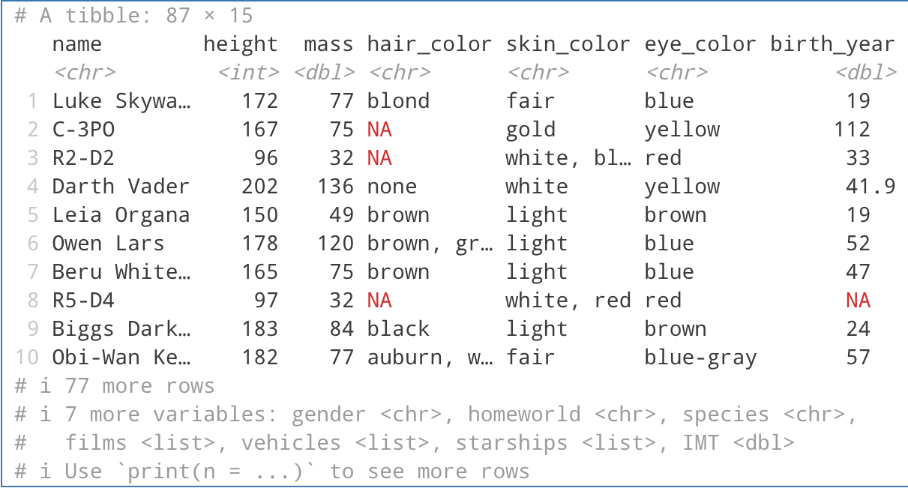
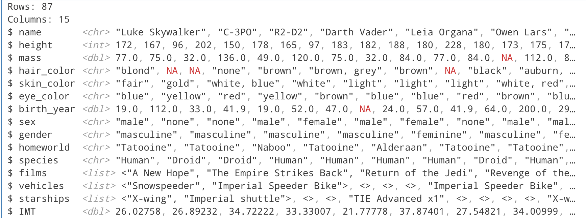

# Основы обработки данных с помощью R и Dplyr
alexkondrol@yandex.ru

## Цель

1.  Развить практические навыки использования языка программирования R
    для обработки данных
2.  Закрепить знания базовых типов данных языка R
3.  Развить практические навыки использования функций обработки данных
    пакета `dplyr` – функции `select()`, `filter()`, `mutate()`,
    `arrange()`, `group_by()`

## Исходные данные

1.  Операционная система GNU/Linux, дистрибутив ALT
2.  Редактор кода Positron
3.  Интерпретатор R
4.  Пакет `dplyr` с встроенными функциями и набором данных `starwars`

## План

Проанализировать встроенный в пакет `dplyr` набор данных `starwars` с
помощью языка R и ответить на вопросы.

## Описание шагов

### 1. Подключение пакета `dplyr`

Импортируем пакет `dplyr`, чтобы использовать набор данных `starwars` из
него не обращаясь к нему каждый раз

``` r
library("dplyr")
```


    Attaching package: 'dplyr'

    The following objects are masked from 'package:stats':

        filter, lag

    The following objects are masked from 'package:base':

        intersect, setdiff, setequal, union

### 2. Базовое ознакомление с набором данных `starwars`

Для выведем датафрейм `starwars`:

``` r
starwars
```

    # A tibble: 87 × 14
       name     height  mass hair_color skin_color eye_color birth_year sex   gender
       <chr>     <int> <dbl> <chr>      <chr>      <chr>          <dbl> <chr> <chr> 
     1 Luke Sk…    172    77 blond      fair       blue            19   male  mascu…
     2 C-3PO       167    75 <NA>       gold       yellow         112   none  mascu…
     3 R2-D2        96    32 <NA>       white, bl… red             33   none  mascu…
     4 Darth V…    202   136 none       white      yellow          41.9 male  mascu…
     5 Leia Or…    150    49 brown      light      brown           19   fema… femin…
     6 Owen La…    178   120 brown, gr… light      blue            52   male  mascu…
     7 Beru Wh…    165    75 brown      light      blue            47   fema… femin…
     8 R5-D4        97    32 <NA>       white, red red             NA   none  mascu…
     9 Biggs D…    183    84 black      light      brown           24   male  mascu…
    10 Obi-Wan…    182    77 auburn, w… fair       blue-gray       57   male  mascu…
    # ℹ 77 more rows
    # ℹ 5 more variables: homeworld <chr>, species <chr>, films <list>,
    #   vehicles <list>, starships <list>



Как видно из изображение выше, в датафрейме `starwars` перечислены
персонажи из франшизы “Звездные войны”, а также сведения о них.

### Ответы на вопросы

#### 1. Сколько строк в датафрейме?

``` r
starwars %>% nrow()
```

    [1] 87

#### 2. Сколько столбцов в датафрейме?

``` r
starwars %>% ncol()
```

    [1] 14

#### 3. Как просмотреть примерный вид датафрейма?

``` r
starwars %>% glimpse()
```

    Rows: 87
    Columns: 14
    $ name       <chr> "Luke Skywalker", "C-3PO", "R2-D2", "Darth Vader", "Leia Or…
    $ height     <int> 172, 167, 96, 202, 150, 178, 165, 97, 183, 182, 188, 180, 2…
    $ mass       <dbl> 77.0, 75.0, 32.0, 136.0, 49.0, 120.0, 75.0, 32.0, 84.0, 77.…
    $ hair_color <chr> "blond", NA, NA, "none", "brown", "brown, grey", "brown", N…
    $ skin_color <chr> "fair", "gold", "white, blue", "white", "light", "light", "…
    $ eye_color  <chr> "blue", "yellow", "red", "yellow", "brown", "blue", "blue",…
    $ birth_year <dbl> 19.0, 112.0, 33.0, 41.9, 19.0, 52.0, 47.0, NA, 24.0, 57.0, …
    $ sex        <chr> "male", "none", "none", "male", "female", "male", "female",…
    $ gender     <chr> "masculine", "masculine", "masculine", "masculine", "femini…
    $ homeworld  <chr> "Tatooine", "Tatooine", "Naboo", "Tatooine", "Alderaan", "T…
    $ species    <chr> "Human", "Droid", "Droid", "Human", "Human", "Human", "Huma…
    $ films      <list> <"A New Hope", "The Empire Strikes Back", "Return of the J…
    $ vehicles   <list> <"Snowspeeder", "Imperial Speeder Bike">, <>, <>, <>, "Imp…
    $ starships  <list> <"X-wing", "Imperial shuttle">, <>, <>, "TIE Advanced x1",…

**Вывод:**



#### 4. Сколько уникальных рас персонажей (species) представлено в данных?

``` r
starwars["species"] %>% unique() %>% nrow() 
```

    [1] 38

#### 5. Найти самого высокого персонажа

``` r
starwars %>% filter(height == max(height, na.rm = TRUE)) %>% 
    select(name, height, species)
```

    # A tibble: 1 × 3
      name        height species 
      <chr>        <int> <chr>   
    1 Yarael Poof    264 Quermian

#### 6. Найти всех персонажей ниже 170

``` r
starwars %>% filter(height < 170) %>% select(name, height)
```

    # A tibble: 22 × 2
       name                  height
       <chr>                  <int>
     1 C-3PO                    167
     2 R2-D2                     96
     3 Leia Organa              150
     4 Beru Whitesun Lars       165
     5 R5-D4                     97
     6 Yoda                      66
     7 Mon Mothma               150
     8 Wicket Systri Warrick     88
     9 Nien Nunb                160
    10 Watto                    137
    # ℹ 12 more rows

#### 7. Подсчитать ИМТ (индекс массы тела) для всех персонажей. ИМТ подсчитать по формуле

``` r
starwars <- starwars %>% mutate(IMT = mass / ( (height / 100) ^ 2 ))
starwars 
```

    # A tibble: 87 × 15
       name     height  mass hair_color skin_color eye_color birth_year sex   gender
       <chr>     <int> <dbl> <chr>      <chr>      <chr>          <dbl> <chr> <chr> 
     1 Luke Sk…    172    77 blond      fair       blue            19   male  mascu…
     2 C-3PO       167    75 <NA>       gold       yellow         112   none  mascu…
     3 R2-D2        96    32 <NA>       white, bl… red             33   none  mascu…
     4 Darth V…    202   136 none       white      yellow          41.9 male  mascu…
     5 Leia Or…    150    49 brown      light      brown           19   fema… femin…
     6 Owen La…    178   120 brown, gr… light      blue            52   male  mascu…
     7 Beru Wh…    165    75 brown      light      blue            47   fema… femin…
     8 R5-D4        97    32 <NA>       white, red red             NA   none  mascu…
     9 Biggs D…    183    84 black      light      brown           24   male  mascu…
    10 Obi-Wan…    182    77 auburn, w… fair       blue-gray       57   male  mascu…
    # ℹ 77 more rows
    # ℹ 6 more variables: homeworld <chr>, species <chr>, films <list>,
    #   vehicles <list>, starships <list>, IMT <dbl>

#### 8. Найти 10 самых “вытянутых” персонажей. “Вытянутость” оценить по отношению массы (mass) к росту (height) персонажей

``` r
top10_stretched <- starwars %>%
  mutate(stretch = mass / (height / 100)) %>% 
  filter(is.finite(stretch)) %>% 
  arrange(desc(stretch)) %>%
  select(name, species, height, mass, stretch) %>%
  slice_head(n = 10)

top10_stretched
```

    # A tibble: 10 × 5
       name                  species    height  mass stretch
       <chr>                 <chr>       <int> <dbl>   <dbl>
     1 Jabba Desilijic Tiure Hutt          175  1358   776  
     2 Grievous              Kaleesh       216   159    73.6
     3 IG-88                 Droid         200   140    70  
     4 Owen Lars             Human         178   120    67.4
     5 Darth Vader           Human         202   136    67.3
     6 Jek Tono Porkins      <NA>          180   110    61.1
     7 Bossk                 Trandoshan    190   113    59.5
     8 Tarfful               Wookiee       234   136    58.1
     9 Dexter Jettster       Besalisk      198   102    51.5
    10 Chewbacca             Wookiee       228   112    49.1

#### 9. Найти средний возраст персонажей каждой расы вселенной Звездных войн.

``` r
starwars %>%
  filter(!is.na(species), !is.na(birth_year)) %>%
  group_by(species) %>%
  summarise(avg_age = mean(birth_year, na.rm = TRUE)) %>%
  arrange(desc(avg_age)) 
```

    # A tibble: 15 × 2
       species        avg_age
       <chr>            <dbl>
     1 Yoda's species   896  
     2 Hutt             600  
     3 Wookiee          200  
     4 Cerean            92  
     5 Zabrak            54  
     6 Human             53.7
     7 Droid             53.3
     8 Trandoshan        53  
     9 Gungan            52  
    10 Mirialan          49  
    11 Twi'lek           48  
    12 Rodian            44  
    13 Mon Calamari      41  
    14 Kel Dor           22  
    15 Ewok               8  

#### 10. Найти самый распространенный цвет глаз персонажей вселенной Звездных войн.

``` r
starwars %>%
  count(eye_color, sort = TRUE) %>%
  slice_head(n = 1) |> knitr::kable(format='markdown')
```

<table>
<thead>
<tr>
<th style="text-align: left;">eye_color</th>
<th style="text-align: right;">n</th>
</tr>
</thead>
<tbody>
<tr>
<td style="text-align: left;">brown</td>
<td style="text-align: right;">21</td>
</tr>
</tbody>
</table>

#### 11. Подсчитать среднюю длину имени в каждой расе вселенной Звездных войн

``` r
starwars %>%
  filter(!is.na(species), !is.na(name)) %>%
  mutate(name_length = nchar(name)) %>%
  group_by(species) %>%
  summarise(
    avg_name_length = round(mean(name_length), 1),
    n = n()
  ) %>%
  arrange(desc(avg_name_length)) 
```

    # A tibble: 37 × 3
       species   avg_name_length     n
       <chr>               <dbl> <int>
     1 Ewok                 21       1
     2 Hutt                 21       1
     3 Geonosian            17       1
     4 Besalisk             15       1
     5 Mirialan             14       2
     6 Toong                14       1
     7 Aleena               12       1
     8 Cerean               12       1
     9 Gungan               11.7     3
    10 Human                11.3    35
    # ℹ 27 more rows

## Оценка результатов

Задача решена с использованием языка программирования R и пакета
`dplyr`. Я научился использовать эти два инструмента для анализа данных.

## Вывод

В данной работе я ответил на вопросы путем анализа и обработки
датафрейма `starwars`
