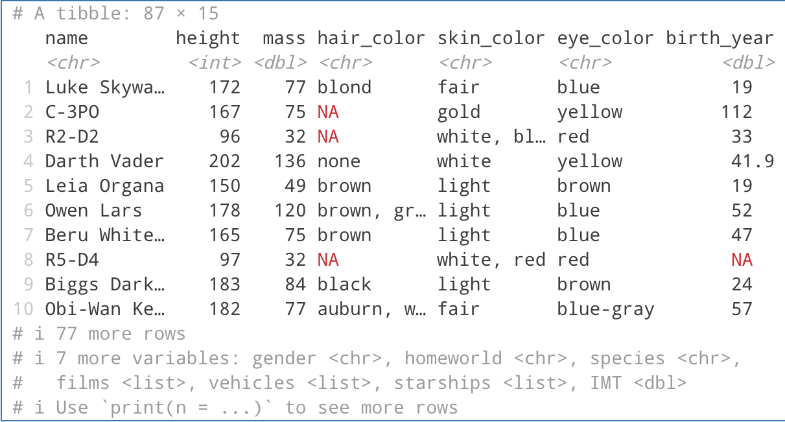
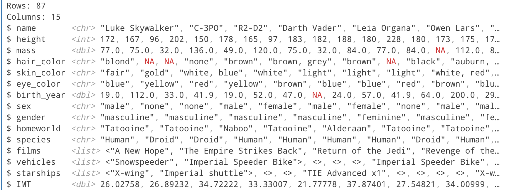

# Основы обработки данных с помощью R и Dplyr
alexkondrol@yandex.ru

## Цель

1.  Развить практические навыки использования языка программирования R
    для обработки данных
2.  Закрепить знания базовых типов данных языка R
3.  Развить практические навыки использования функций обработки данных
    пакета `dplyr` – функции `select()`, `filter()`, `mutate()`,
    `arrange()`, `group_by()`

## Исходные данные

1.  Операционная система GNU/Linux, дистрибутив ALT
2.  Редактор кода Positron
3.  Интерпретатор R
4.  Пакет `dplyr` с встроенными функциями и набором данных `starwars`

## План

Проанализировать встроенный в пакет `dplyr` набор данных `starwars` с
помощью языка R и ответить на вопросы.

## Описание шагов

### 1. Подключение пакета `dplyr`

Импортируем пакет `dplyr`, чтобы использовать набор данных `starwars` из
него не обращаясь к нему каждый раз

``` r
library("dplyr")
```

### 2. Базовое ознакомление с набором данных `starwars`

Для выведем датафрейм `starwars`:

``` r
starwars
```



Как видно из изображение выше, в датафрейме `starwars` перечислены
персонажи из франшизы “Звездные войны”, а также сведения о них.

### Ответы на вопросы

#### 1. Сколько строк в датафрейме?

``` r
starwars %>% nrow()
```

**Вывод:** 87

#### 2. Сколько столбцов в датафрейме?

``` r
starwars %>% ncol()
```

**Вывод:** 14

#### 3. Как просмотреть примерный вид датафрейма?

``` r
starwars %>% glimpse()
```

**Вывод:**



#### 4. Сколько уникальных рас персонажей (species) представлено в данных?

``` r
starwars["species"] %>% unique() %>% nrow() 
```

**Вывод:** 38

#### 5. Найти самого высокого персонажа

``` r
starwars %>% filter(height == max(height, na.rm = TRUE)) %>% 
    select(name, height, species)
```

**Вывод:**

<table>
<thead>
<tr>
<th style="text-align: left;">name</th>
<th style="text-align: right;">height</th>
<th style="text-align: left;">species</th>
</tr>
</thead>
<tbody>
<tr>
<td style="text-align: left;">Yarael Poof</td>
<td style="text-align: right;">264</td>
<td style="text-align: left;">Quermian</td>
</tr>
</tbody>
</table>

#### 6. Найти всех персонажей ниже 170

``` r
starwars %>% filter(height < 170) %>% select(name, height)
```

**Вывод:**

<table>
<thead>
<tr>
<th style="text-align: left;">name</th>
<th style="text-align: right;">height</th>
</tr>
</thead>
<tbody>
<tr>
<td style="text-align: left;">C-3PO</td>
<td style="text-align: right;">167</td>
</tr>
<tr>
<td style="text-align: left;">R2-D2</td>
<td style="text-align: right;">96</td>
</tr>
<tr>
<td style="text-align: left;">Leia Organa</td>
<td style="text-align: right;">150</td>
</tr>
<tr>
<td style="text-align: left;">Beru Whitesun Lars</td>
<td style="text-align: right;">165</td>
</tr>
<tr>
<td style="text-align: left;">R5-D4</td>
<td style="text-align: right;">97</td>
</tr>
<tr>
<td style="text-align: left;">Yoda</td>
<td style="text-align: right;">66</td>
</tr>
<tr>
<td style="text-align: left;">Mon Mothma</td>
<td style="text-align: right;">150</td>
</tr>
<tr>
<td style="text-align: left;">Wicket Systri Warrick</td>
<td style="text-align: right;">88</td>
</tr>
<tr>
<td style="text-align: left;">Nien Nunb</td>
<td style="text-align: right;">160</td>
</tr>
<tr>
<td style="text-align: left;">Watto</td>
<td style="text-align: right;">137</td>
</tr>
<tr>
<td style="text-align: left;">Sebulba</td>
<td style="text-align: right;">112</td>
</tr>
<tr>
<td style="text-align: left;">Shmi Skywalker</td>
<td style="text-align: right;">163</td>
</tr>
<tr>
<td style="text-align: left;">Ratts Tyerel</td>
<td style="text-align: right;">79</td>
</tr>
<tr>
<td style="text-align: left;">Dud Bolt</td>
<td style="text-align: right;">94</td>
</tr>
<tr>
<td style="text-align: left;">Gasgano</td>
<td style="text-align: right;">122</td>
</tr>
<tr>
<td style="text-align: left;">Ben Quadinaros</td>
<td style="text-align: right;">163</td>
</tr>
<tr>
<td style="text-align: left;">Cordé</td>
<td style="text-align: right;">157</td>
</tr>
<tr>
<td style="text-align: left;">Barriss Offee</td>
<td style="text-align: right;">166</td>
</tr>
<tr>
<td style="text-align: left;">Dormé</td>
<td style="text-align: right;">165</td>
</tr>
<tr>
<td style="text-align: left;">Zam Wesell</td>
<td style="text-align: right;">168</td>
</tr>
<tr>
<td style="text-align: left;">Jocasta Nu</td>
<td style="text-align: right;">167</td>
</tr>
<tr>
<td style="text-align: left;">R4-P17</td>
<td style="text-align: right;">96</td>
</tr>
</tbody>
</table>

#### 7. Подсчитать ИМТ (индекс массы тела) для всех персонажей. ИМТ подсчитать по формуле

``` r
starwars <- starwars %>% mutate(IMT = mass / ( (height / 100) ^ 2 ))
starwars 
```

**Вывод:**

<table>
<colgroup>
<col style="width: 6%" />
<col style="width: 6%" />
<col style="width: 6%" />
<col style="width: 6%" />
<col style="width: 6%" />
<col style="width: 6%" />
<col style="width: 6%" />
<col style="width: 6%" />
<col style="width: 6%" />
<col style="width: 6%" />
<col style="width: 6%" />
<col style="width: 12%" />
<col style="width: 6%" />
<col style="width: 6%" />
<col style="width: 6%" />
</colgroup>
<thead>
<tr>
<th style="text-align: left;">name</th>
<th style="text-align: right;">height</th>
<th style="text-align: right;">mass</th>
<th style="text-align: left;">hair_color</th>
<th style="text-align: left;">skin_color</th>
<th style="text-align: left;">eye_color</th>
<th style="text-align: right;">birth_year</th>
<th style="text-align: left;">sex</th>
<th style="text-align: left;">gender</th>
<th style="text-align: left;">homeworld</th>
<th style="text-align: left;">species</th>
<th style="text-align: left;">films</th>
<th style="text-align: left;">vehicles</th>
<th style="text-align: left;">starships</th>
<th style="text-align: right;">IMT</th>
</tr>
</thead>
<tbody>
<tr>
<td style="text-align: left;">Luke Skywalker</td>
<td style="text-align: right;">172</td>
<td style="text-align: right;">77.0</td>
<td style="text-align: left;">blond</td>
<td style="text-align: left;">fair</td>
<td style="text-align: left;">blue</td>
<td style="text-align: right;">19.0</td>
<td style="text-align: left;">male</td>
<td style="text-align: left;">masculine</td>
<td style="text-align: left;">Tatooine</td>
<td style="text-align: left;">Human</td>
<td style="text-align: left;">A New Hope , The Empire Strikes Back,
Return of the Jedi , Revenge of the Sith , The Force Awakens</td>
<td style="text-align: left;">Snowspeeder , Imperial Speeder Bike</td>
<td style="text-align: left;">X-wing , Imperial shuttle</td>
<td style="text-align: right;">26.02758</td>
</tr>
<tr>
<td style="text-align: left;">C-3PO</td>
<td style="text-align: right;">167</td>
<td style="text-align: right;">75.0</td>
<td style="text-align: left;">NA</td>
<td style="text-align: left;">gold</td>
<td style="text-align: left;">yellow</td>
<td style="text-align: right;">112.0</td>
<td style="text-align: left;">none</td>
<td style="text-align: left;">masculine</td>
<td style="text-align: left;">Tatooine</td>
<td style="text-align: left;">Droid</td>
<td style="text-align: left;">A New Hope , The Empire Strikes Back,
Return of the Jedi , The Phantom Menace , Attack of the Clones , Revenge
of the Sith</td>
<td style="text-align: left;"></td>
<td style="text-align: left;"></td>
<td style="text-align: right;">26.89232</td>
</tr>
<tr>
<td style="text-align: left;">R2-D2</td>
<td style="text-align: right;">96</td>
<td style="text-align: right;">32.0</td>
<td style="text-align: left;">NA</td>
<td style="text-align: left;">white, blue</td>
<td style="text-align: left;">red</td>
<td style="text-align: right;">33.0</td>
<td style="text-align: left;">none</td>
<td style="text-align: left;">masculine</td>
<td style="text-align: left;">Naboo</td>
<td style="text-align: left;">Droid</td>
<td style="text-align: left;">A New Hope , The Empire Strikes Back,
Return of the Jedi , The Phantom Menace , Attack of the Clones , Revenge
of the Sith , The Force Awakens</td>
<td style="text-align: left;"></td>
<td style="text-align: left;"></td>
<td style="text-align: right;">34.72222</td>
</tr>
<tr>
<td style="text-align: left;">Darth Vader</td>
<td style="text-align: right;">202</td>
<td style="text-align: right;">136.0</td>
<td style="text-align: left;">none</td>
<td style="text-align: left;">white</td>
<td style="text-align: left;">yellow</td>
<td style="text-align: right;">41.9</td>
<td style="text-align: left;">male</td>
<td style="text-align: left;">masculine</td>
<td style="text-align: left;">Tatooine</td>
<td style="text-align: left;">Human</td>
<td style="text-align: left;">A New Hope , The Empire Strikes Back,
Return of the Jedi , Revenge of the Sith</td>
<td style="text-align: left;"></td>
<td style="text-align: left;">TIE Advanced x1</td>
<td style="text-align: right;">33.33007</td>
</tr>
<tr>
<td style="text-align: left;">Leia Organa</td>
<td style="text-align: right;">150</td>
<td style="text-align: right;">49.0</td>
<td style="text-align: left;">brown</td>
<td style="text-align: left;">light</td>
<td style="text-align: left;">brown</td>
<td style="text-align: right;">19.0</td>
<td style="text-align: left;">female</td>
<td style="text-align: left;">feminine</td>
<td style="text-align: left;">Alderaan</td>
<td style="text-align: left;">Human</td>
<td style="text-align: left;">A New Hope , The Empire Strikes Back,
Return of the Jedi , Revenge of the Sith , The Force Awakens</td>
<td style="text-align: left;">Imperial Speeder Bike</td>
<td style="text-align: left;"></td>
<td style="text-align: right;">21.77778</td>
</tr>
<tr>
<td style="text-align: left;">Owen Lars</td>
<td style="text-align: right;">178</td>
<td style="text-align: right;">120.0</td>
<td style="text-align: left;">brown, grey</td>
<td style="text-align: left;">light</td>
<td style="text-align: left;">blue</td>
<td style="text-align: right;">52.0</td>
<td style="text-align: left;">male</td>
<td style="text-align: left;">masculine</td>
<td style="text-align: left;">Tatooine</td>
<td style="text-align: left;">Human</td>
<td style="text-align: left;">A New Hope , Attack of the Clones, Revenge
of the Sith</td>
<td style="text-align: left;"></td>
<td style="text-align: left;"></td>
<td style="text-align: right;">37.87401</td>
</tr>
<tr>
<td style="text-align: left;">Beru Whitesun Lars</td>
<td style="text-align: right;">165</td>
<td style="text-align: right;">75.0</td>
<td style="text-align: left;">brown</td>
<td style="text-align: left;">light</td>
<td style="text-align: left;">blue</td>
<td style="text-align: right;">47.0</td>
<td style="text-align: left;">female</td>
<td style="text-align: left;">feminine</td>
<td style="text-align: left;">Tatooine</td>
<td style="text-align: left;">Human</td>
<td style="text-align: left;">A New Hope , Attack of the Clones, Revenge
of the Sith</td>
<td style="text-align: left;"></td>
<td style="text-align: left;"></td>
<td style="text-align: right;">27.54821</td>
</tr>
<tr>
<td style="text-align: left;">R5-D4</td>
<td style="text-align: right;">97</td>
<td style="text-align: right;">32.0</td>
<td style="text-align: left;">NA</td>
<td style="text-align: left;">white, red</td>
<td style="text-align: left;">red</td>
<td style="text-align: right;">NA</td>
<td style="text-align: left;">none</td>
<td style="text-align: left;">masculine</td>
<td style="text-align: left;">Tatooine</td>
<td style="text-align: left;">Droid</td>
<td style="text-align: left;">A New Hope</td>
<td style="text-align: left;"></td>
<td style="text-align: left;"></td>
<td style="text-align: right;">34.00999</td>
</tr>
<tr>
<td style="text-align: left;">Biggs Darklighter</td>
<td style="text-align: right;">183</td>
<td style="text-align: right;">84.0</td>
<td style="text-align: left;">black</td>
<td style="text-align: left;">light</td>
<td style="text-align: left;">brown</td>
<td style="text-align: right;">24.0</td>
<td style="text-align: left;">male</td>
<td style="text-align: left;">masculine</td>
<td style="text-align: left;">Tatooine</td>
<td style="text-align: left;">Human</td>
<td style="text-align: left;">A New Hope</td>
<td style="text-align: left;"></td>
<td style="text-align: left;">X-wing</td>
<td style="text-align: right;">25.08286</td>
</tr>
<tr>
<td style="text-align: left;">Obi-Wan Kenobi</td>
<td style="text-align: right;">182</td>
<td style="text-align: right;">77.0</td>
<td style="text-align: left;">auburn, white</td>
<td style="text-align: left;">fair</td>
<td style="text-align: left;">blue-gray</td>
<td style="text-align: right;">57.0</td>
<td style="text-align: left;">male</td>
<td style="text-align: left;">masculine</td>
<td style="text-align: left;">Stewjon</td>
<td style="text-align: left;">Human</td>
<td style="text-align: left;">A New Hope , The Empire Strikes Back,
Return of the Jedi , The Phantom Menace , Attack of the Clones , Revenge
of the Sith</td>
<td style="text-align: left;">Tribubble bongo</td>
<td style="text-align: left;">Jedi starfighter , Trade Federation
cruiser, Naboo star skiff , Jedi Interceptor , Belbullab-22
starfighter</td>
<td style="text-align: right;">23.24598</td>
</tr>
<tr>
<td style="text-align: left;">Anakin Skywalker</td>
<td style="text-align: right;">188</td>
<td style="text-align: right;">84.0</td>
<td style="text-align: left;">blond</td>
<td style="text-align: left;">fair</td>
<td style="text-align: left;">blue</td>
<td style="text-align: right;">41.9</td>
<td style="text-align: left;">male</td>
<td style="text-align: left;">masculine</td>
<td style="text-align: left;">Tatooine</td>
<td style="text-align: left;">Human</td>
<td style="text-align: left;">The Phantom Menace , Attack of the Clones,
Revenge of the Sith</td>
<td style="text-align: left;">Zephyr-G swoop bike, XJ-6 airspeeder</td>
<td style="text-align: left;">Naboo fighter , Trade Federation cruiser,
Jedi Interceptor</td>
<td style="text-align: right;">23.76641</td>
</tr>
<tr>
<td style="text-align: left;">Wilhuff Tarkin</td>
<td style="text-align: right;">180</td>
<td style="text-align: right;">NA</td>
<td style="text-align: left;">auburn, grey</td>
<td style="text-align: left;">fair</td>
<td style="text-align: left;">blue</td>
<td style="text-align: right;">64.0</td>
<td style="text-align: left;">male</td>
<td style="text-align: left;">masculine</td>
<td style="text-align: left;">Eriadu</td>
<td style="text-align: left;">Human</td>
<td style="text-align: left;">A New Hope , Revenge of the Sith</td>
<td style="text-align: left;"></td>
<td style="text-align: left;"></td>
<td style="text-align: right;">NA</td>
</tr>
<tr>
<td style="text-align: left;">Chewbacca</td>
<td style="text-align: right;">228</td>
<td style="text-align: right;">112.0</td>
<td style="text-align: left;">brown</td>
<td style="text-align: left;">unknown</td>
<td style="text-align: left;">blue</td>
<td style="text-align: right;">200.0</td>
<td style="text-align: left;">male</td>
<td style="text-align: left;">masculine</td>
<td style="text-align: left;">Kashyyyk</td>
<td style="text-align: left;">Wookiee</td>
<td style="text-align: left;">A New Hope , The Empire Strikes Back,
Return of the Jedi , Revenge of the Sith , The Force Awakens</td>
<td style="text-align: left;">AT-ST</td>
<td style="text-align: left;">Millennium Falcon, Imperial shuttle</td>
<td style="text-align: right;">21.54509</td>
</tr>
<tr>
<td style="text-align: left;">Han Solo</td>
<td style="text-align: right;">180</td>
<td style="text-align: right;">80.0</td>
<td style="text-align: left;">brown</td>
<td style="text-align: left;">fair</td>
<td style="text-align: left;">brown</td>
<td style="text-align: right;">29.0</td>
<td style="text-align: left;">male</td>
<td style="text-align: left;">masculine</td>
<td style="text-align: left;">Corellia</td>
<td style="text-align: left;">Human</td>
<td style="text-align: left;">A New Hope , The Empire Strikes Back,
Return of the Jedi , The Force Awakens</td>
<td style="text-align: left;"></td>
<td style="text-align: left;">Millennium Falcon, Imperial shuttle</td>
<td style="text-align: right;">24.69136</td>
</tr>
<tr>
<td style="text-align: left;">Greedo</td>
<td style="text-align: right;">173</td>
<td style="text-align: right;">74.0</td>
<td style="text-align: left;">NA</td>
<td style="text-align: left;">green</td>
<td style="text-align: left;">black</td>
<td style="text-align: right;">44.0</td>
<td style="text-align: left;">male</td>
<td style="text-align: left;">masculine</td>
<td style="text-align: left;">Rodia</td>
<td style="text-align: left;">Rodian</td>
<td style="text-align: left;">A New Hope</td>
<td style="text-align: left;"></td>
<td style="text-align: left;"></td>
<td style="text-align: right;">24.72518</td>
</tr>
<tr>
<td style="text-align: left;">Jabba Desilijic Tiure</td>
<td style="text-align: right;">175</td>
<td style="text-align: right;">1358.0</td>
<td style="text-align: left;">NA</td>
<td style="text-align: left;">green-tan, brown</td>
<td style="text-align: left;">orange</td>
<td style="text-align: right;">600.0</td>
<td style="text-align: left;">hermaphroditic</td>
<td style="text-align: left;">masculine</td>
<td style="text-align: left;">Nal Hutta</td>
<td style="text-align: left;">Hutt</td>
<td style="text-align: left;">A New Hope , Return of the Jedi, The
Phantom Menace</td>
<td style="text-align: left;"></td>
<td style="text-align: left;"></td>
<td style="text-align: right;">443.42857</td>
</tr>
<tr>
<td style="text-align: left;">Wedge Antilles</td>
<td style="text-align: right;">170</td>
<td style="text-align: right;">77.0</td>
<td style="text-align: left;">brown</td>
<td style="text-align: left;">fair</td>
<td style="text-align: left;">hazel</td>
<td style="text-align: right;">21.0</td>
<td style="text-align: left;">male</td>
<td style="text-align: left;">masculine</td>
<td style="text-align: left;">Corellia</td>
<td style="text-align: left;">Human</td>
<td style="text-align: left;">A New Hope , The Empire Strikes Back,
Return of the Jedi</td>
<td style="text-align: left;">Snowspeeder</td>
<td style="text-align: left;">X-wing</td>
<td style="text-align: right;">26.64360</td>
</tr>
<tr>
<td style="text-align: left;">Jek Tono Porkins</td>
<td style="text-align: right;">180</td>
<td style="text-align: right;">110.0</td>
<td style="text-align: left;">brown</td>
<td style="text-align: left;">fair</td>
<td style="text-align: left;">blue</td>
<td style="text-align: right;">NA</td>
<td style="text-align: left;">NA</td>
<td style="text-align: left;">NA</td>
<td style="text-align: left;">Bestine IV</td>
<td style="text-align: left;">NA</td>
<td style="text-align: left;">A New Hope</td>
<td style="text-align: left;"></td>
<td style="text-align: left;">X-wing</td>
<td style="text-align: right;">33.95062</td>
</tr>
<tr>
<td style="text-align: left;">Yoda</td>
<td style="text-align: right;">66</td>
<td style="text-align: right;">17.0</td>
<td style="text-align: left;">white</td>
<td style="text-align: left;">green</td>
<td style="text-align: left;">brown</td>
<td style="text-align: right;">896.0</td>
<td style="text-align: left;">male</td>
<td style="text-align: left;">masculine</td>
<td style="text-align: left;">NA</td>
<td style="text-align: left;">Yoda’s species</td>
<td style="text-align: left;">The Empire Strikes Back, Return of the
Jedi , The Phantom Menace , Attack of the Clones , Revenge of the
Sith</td>
<td style="text-align: left;"></td>
<td style="text-align: left;"></td>
<td style="text-align: right;">39.02663</td>
</tr>
<tr>
<td style="text-align: left;">Palpatine</td>
<td style="text-align: right;">170</td>
<td style="text-align: right;">75.0</td>
<td style="text-align: left;">grey</td>
<td style="text-align: left;">pale</td>
<td style="text-align: left;">yellow</td>
<td style="text-align: right;">82.0</td>
<td style="text-align: left;">male</td>
<td style="text-align: left;">masculine</td>
<td style="text-align: left;">Naboo</td>
<td style="text-align: left;">Human</td>
<td style="text-align: left;">The Empire Strikes Back, Return of the
Jedi , The Phantom Menace , Attack of the Clones , Revenge of the
Sith</td>
<td style="text-align: left;"></td>
<td style="text-align: left;"></td>
<td style="text-align: right;">25.95156</td>
</tr>
<tr>
<td style="text-align: left;">Boba Fett</td>
<td style="text-align: right;">183</td>
<td style="text-align: right;">78.2</td>
<td style="text-align: left;">black</td>
<td style="text-align: left;">fair</td>
<td style="text-align: left;">brown</td>
<td style="text-align: right;">31.5</td>
<td style="text-align: left;">male</td>
<td style="text-align: left;">masculine</td>
<td style="text-align: left;">Kamino</td>
<td style="text-align: left;">Human</td>
<td style="text-align: left;">The Empire Strikes Back, Return of the
Jedi , Attack of the Clones</td>
<td style="text-align: left;"></td>
<td style="text-align: left;">Slave 1</td>
<td style="text-align: right;">23.35095</td>
</tr>
<tr>
<td style="text-align: left;">IG-88</td>
<td style="text-align: right;">200</td>
<td style="text-align: right;">140.0</td>
<td style="text-align: left;">none</td>
<td style="text-align: left;">metal</td>
<td style="text-align: left;">red</td>
<td style="text-align: right;">15.0</td>
<td style="text-align: left;">none</td>
<td style="text-align: left;">masculine</td>
<td style="text-align: left;">NA</td>
<td style="text-align: left;">Droid</td>
<td style="text-align: left;">The Empire Strikes Back</td>
<td style="text-align: left;"></td>
<td style="text-align: left;"></td>
<td style="text-align: right;">35.00000</td>
</tr>
<tr>
<td style="text-align: left;">Bossk</td>
<td style="text-align: right;">190</td>
<td style="text-align: right;">113.0</td>
<td style="text-align: left;">none</td>
<td style="text-align: left;">green</td>
<td style="text-align: left;">red</td>
<td style="text-align: right;">53.0</td>
<td style="text-align: left;">male</td>
<td style="text-align: left;">masculine</td>
<td style="text-align: left;">Trandosha</td>
<td style="text-align: left;">Trandoshan</td>
<td style="text-align: left;">The Empire Strikes Back</td>
<td style="text-align: left;"></td>
<td style="text-align: left;"></td>
<td style="text-align: right;">31.30194</td>
</tr>
<tr>
<td style="text-align: left;">Lando Calrissian</td>
<td style="text-align: right;">177</td>
<td style="text-align: right;">79.0</td>
<td style="text-align: left;">black</td>
<td style="text-align: left;">dark</td>
<td style="text-align: left;">brown</td>
<td style="text-align: right;">31.0</td>
<td style="text-align: left;">male</td>
<td style="text-align: left;">masculine</td>
<td style="text-align: left;">Socorro</td>
<td style="text-align: left;">Human</td>
<td style="text-align: left;">The Empire Strikes Back, Return of the
Jedi</td>
<td style="text-align: left;"></td>
<td style="text-align: left;">Millennium Falcon</td>
<td style="text-align: right;">25.21625</td>
</tr>
<tr>
<td style="text-align: left;">Lobot</td>
<td style="text-align: right;">175</td>
<td style="text-align: right;">79.0</td>
<td style="text-align: left;">none</td>
<td style="text-align: left;">light</td>
<td style="text-align: left;">blue</td>
<td style="text-align: right;">37.0</td>
<td style="text-align: left;">male</td>
<td style="text-align: left;">masculine</td>
<td style="text-align: left;">Bespin</td>
<td style="text-align: left;">Human</td>
<td style="text-align: left;">The Empire Strikes Back</td>
<td style="text-align: left;"></td>
<td style="text-align: left;"></td>
<td style="text-align: right;">25.79592</td>
</tr>
<tr>
<td style="text-align: left;">Ackbar</td>
<td style="text-align: right;">180</td>
<td style="text-align: right;">83.0</td>
<td style="text-align: left;">none</td>
<td style="text-align: left;">brown mottle</td>
<td style="text-align: left;">orange</td>
<td style="text-align: right;">41.0</td>
<td style="text-align: left;">male</td>
<td style="text-align: left;">masculine</td>
<td style="text-align: left;">Mon Cala</td>
<td style="text-align: left;">Mon Calamari</td>
<td style="text-align: left;">Return of the Jedi, The Force Awakens</td>
<td style="text-align: left;"></td>
<td style="text-align: left;"></td>
<td style="text-align: right;">25.61728</td>
</tr>
<tr>
<td style="text-align: left;">Mon Mothma</td>
<td style="text-align: right;">150</td>
<td style="text-align: right;">NA</td>
<td style="text-align: left;">auburn</td>
<td style="text-align: left;">fair</td>
<td style="text-align: left;">blue</td>
<td style="text-align: right;">48.0</td>
<td style="text-align: left;">female</td>
<td style="text-align: left;">feminine</td>
<td style="text-align: left;">Chandrila</td>
<td style="text-align: left;">Human</td>
<td style="text-align: left;">Return of the Jedi</td>
<td style="text-align: left;"></td>
<td style="text-align: left;"></td>
<td style="text-align: right;">NA</td>
</tr>
<tr>
<td style="text-align: left;">Arvel Crynyd</td>
<td style="text-align: right;">NA</td>
<td style="text-align: right;">NA</td>
<td style="text-align: left;">brown</td>
<td style="text-align: left;">fair</td>
<td style="text-align: left;">brown</td>
<td style="text-align: right;">NA</td>
<td style="text-align: left;">male</td>
<td style="text-align: left;">masculine</td>
<td style="text-align: left;">NA</td>
<td style="text-align: left;">Human</td>
<td style="text-align: left;">Return of the Jedi</td>
<td style="text-align: left;"></td>
<td style="text-align: left;">A-wing</td>
<td style="text-align: right;">NA</td>
</tr>
<tr>
<td style="text-align: left;">Wicket Systri Warrick</td>
<td style="text-align: right;">88</td>
<td style="text-align: right;">20.0</td>
<td style="text-align: left;">brown</td>
<td style="text-align: left;">brown</td>
<td style="text-align: left;">brown</td>
<td style="text-align: right;">8.0</td>
<td style="text-align: left;">male</td>
<td style="text-align: left;">masculine</td>
<td style="text-align: left;">Endor</td>
<td style="text-align: left;">Ewok</td>
<td style="text-align: left;">Return of the Jedi</td>
<td style="text-align: left;"></td>
<td style="text-align: left;"></td>
<td style="text-align: right;">25.82645</td>
</tr>
<tr>
<td style="text-align: left;">Nien Nunb</td>
<td style="text-align: right;">160</td>
<td style="text-align: right;">68.0</td>
<td style="text-align: left;">none</td>
<td style="text-align: left;">grey</td>
<td style="text-align: left;">black</td>
<td style="text-align: right;">NA</td>
<td style="text-align: left;">male</td>
<td style="text-align: left;">masculine</td>
<td style="text-align: left;">Sullust</td>
<td style="text-align: left;">Sullustan</td>
<td style="text-align: left;">Return of the Jedi</td>
<td style="text-align: left;"></td>
<td style="text-align: left;">Millennium Falcon</td>
<td style="text-align: right;">26.56250</td>
</tr>
<tr>
<td style="text-align: left;">Qui-Gon Jinn</td>
<td style="text-align: right;">193</td>
<td style="text-align: right;">89.0</td>
<td style="text-align: left;">brown</td>
<td style="text-align: left;">fair</td>
<td style="text-align: left;">blue</td>
<td style="text-align: right;">92.0</td>
<td style="text-align: left;">male</td>
<td style="text-align: left;">masculine</td>
<td style="text-align: left;">NA</td>
<td style="text-align: left;">Human</td>
<td style="text-align: left;">The Phantom Menace</td>
<td style="text-align: left;">Tribubble bongo</td>
<td style="text-align: left;"></td>
<td style="text-align: right;">23.89326</td>
</tr>
<tr>
<td style="text-align: left;">Nute Gunray</td>
<td style="text-align: right;">191</td>
<td style="text-align: right;">90.0</td>
<td style="text-align: left;">none</td>
<td style="text-align: left;">mottled green</td>
<td style="text-align: left;">red</td>
<td style="text-align: right;">NA</td>
<td style="text-align: left;">male</td>
<td style="text-align: left;">masculine</td>
<td style="text-align: left;">Cato Neimoidia</td>
<td style="text-align: left;">Neimodian</td>
<td style="text-align: left;">The Phantom Menace , Attack of the Clones,
Revenge of the Sith</td>
<td style="text-align: left;"></td>
<td style="text-align: left;"></td>
<td style="text-align: right;">24.67038</td>
</tr>
<tr>
<td style="text-align: left;">Finis Valorum</td>
<td style="text-align: right;">170</td>
<td style="text-align: right;">NA</td>
<td style="text-align: left;">blond</td>
<td style="text-align: left;">fair</td>
<td style="text-align: left;">blue</td>
<td style="text-align: right;">91.0</td>
<td style="text-align: left;">male</td>
<td style="text-align: left;">masculine</td>
<td style="text-align: left;">Coruscant</td>
<td style="text-align: left;">Human</td>
<td style="text-align: left;">The Phantom Menace</td>
<td style="text-align: left;"></td>
<td style="text-align: left;"></td>
<td style="text-align: right;">NA</td>
</tr>
<tr>
<td style="text-align: left;">Padmé Amidala</td>
<td style="text-align: right;">185</td>
<td style="text-align: right;">45.0</td>
<td style="text-align: left;">brown</td>
<td style="text-align: left;">light</td>
<td style="text-align: left;">brown</td>
<td style="text-align: right;">46.0</td>
<td style="text-align: left;">female</td>
<td style="text-align: left;">feminine</td>
<td style="text-align: left;">Naboo</td>
<td style="text-align: left;">Human</td>
<td style="text-align: left;">The Phantom Menace , Attack of the Clones,
Revenge of the Sith</td>
<td style="text-align: left;"></td>
<td style="text-align: left;">Naboo fighter , H-type Nubian yacht, Naboo
star skiff</td>
<td style="text-align: right;">13.14828</td>
</tr>
<tr>
<td style="text-align: left;">Jar Jar Binks</td>
<td style="text-align: right;">196</td>
<td style="text-align: right;">66.0</td>
<td style="text-align: left;">none</td>
<td style="text-align: left;">orange</td>
<td style="text-align: left;">orange</td>
<td style="text-align: right;">52.0</td>
<td style="text-align: left;">male</td>
<td style="text-align: left;">masculine</td>
<td style="text-align: left;">Naboo</td>
<td style="text-align: left;">Gungan</td>
<td style="text-align: left;">The Phantom Menace , Attack of the
Clones</td>
<td style="text-align: left;"></td>
<td style="text-align: left;"></td>
<td style="text-align: right;">17.18034</td>
</tr>
<tr>
<td style="text-align: left;">Roos Tarpals</td>
<td style="text-align: right;">224</td>
<td style="text-align: right;">82.0</td>
<td style="text-align: left;">none</td>
<td style="text-align: left;">grey</td>
<td style="text-align: left;">orange</td>
<td style="text-align: right;">NA</td>
<td style="text-align: left;">male</td>
<td style="text-align: left;">masculine</td>
<td style="text-align: left;">Naboo</td>
<td style="text-align: left;">Gungan</td>
<td style="text-align: left;">The Phantom Menace</td>
<td style="text-align: left;"></td>
<td style="text-align: left;"></td>
<td style="text-align: right;">16.34247</td>
</tr>
<tr>
<td style="text-align: left;">Rugor Nass</td>
<td style="text-align: right;">206</td>
<td style="text-align: right;">NA</td>
<td style="text-align: left;">none</td>
<td style="text-align: left;">green</td>
<td style="text-align: left;">orange</td>
<td style="text-align: right;">NA</td>
<td style="text-align: left;">male</td>
<td style="text-align: left;">masculine</td>
<td style="text-align: left;">Naboo</td>
<td style="text-align: left;">Gungan</td>
<td style="text-align: left;">The Phantom Menace</td>
<td style="text-align: left;"></td>
<td style="text-align: left;"></td>
<td style="text-align: right;">NA</td>
</tr>
<tr>
<td style="text-align: left;">Ric Olié</td>
<td style="text-align: right;">183</td>
<td style="text-align: right;">NA</td>
<td style="text-align: left;">brown</td>
<td style="text-align: left;">fair</td>
<td style="text-align: left;">blue</td>
<td style="text-align: right;">NA</td>
<td style="text-align: left;">male</td>
<td style="text-align: left;">masculine</td>
<td style="text-align: left;">Naboo</td>
<td style="text-align: left;">Human</td>
<td style="text-align: left;">The Phantom Menace</td>
<td style="text-align: left;"></td>
<td style="text-align: left;">Naboo Royal Starship</td>
<td style="text-align: right;">NA</td>
</tr>
<tr>
<td style="text-align: left;">Watto</td>
<td style="text-align: right;">137</td>
<td style="text-align: right;">NA</td>
<td style="text-align: left;">black</td>
<td style="text-align: left;">blue, grey</td>
<td style="text-align: left;">yellow</td>
<td style="text-align: right;">NA</td>
<td style="text-align: left;">male</td>
<td style="text-align: left;">masculine</td>
<td style="text-align: left;">Toydaria</td>
<td style="text-align: left;">Toydarian</td>
<td style="text-align: left;">The Phantom Menace , Attack of the
Clones</td>
<td style="text-align: left;"></td>
<td style="text-align: left;"></td>
<td style="text-align: right;">NA</td>
</tr>
<tr>
<td style="text-align: left;">Sebulba</td>
<td style="text-align: right;">112</td>
<td style="text-align: right;">40.0</td>
<td style="text-align: left;">none</td>
<td style="text-align: left;">grey, red</td>
<td style="text-align: left;">orange</td>
<td style="text-align: right;">NA</td>
<td style="text-align: left;">male</td>
<td style="text-align: left;">masculine</td>
<td style="text-align: left;">Malastare</td>
<td style="text-align: left;">Dug</td>
<td style="text-align: left;">The Phantom Menace</td>
<td style="text-align: left;"></td>
<td style="text-align: left;"></td>
<td style="text-align: right;">31.88776</td>
</tr>
<tr>
<td style="text-align: left;">Quarsh Panaka</td>
<td style="text-align: right;">183</td>
<td style="text-align: right;">NA</td>
<td style="text-align: left;">black</td>
<td style="text-align: left;">dark</td>
<td style="text-align: left;">brown</td>
<td style="text-align: right;">62.0</td>
<td style="text-align: left;">male</td>
<td style="text-align: left;">masculine</td>
<td style="text-align: left;">Naboo</td>
<td style="text-align: left;">Human</td>
<td style="text-align: left;">The Phantom Menace</td>
<td style="text-align: left;"></td>
<td style="text-align: left;"></td>
<td style="text-align: right;">NA</td>
</tr>
<tr>
<td style="text-align: left;">Shmi Skywalker</td>
<td style="text-align: right;">163</td>
<td style="text-align: right;">NA</td>
<td style="text-align: left;">black</td>
<td style="text-align: left;">fair</td>
<td style="text-align: left;">brown</td>
<td style="text-align: right;">72.0</td>
<td style="text-align: left;">female</td>
<td style="text-align: left;">feminine</td>
<td style="text-align: left;">Tatooine</td>
<td style="text-align: left;">Human</td>
<td style="text-align: left;">The Phantom Menace , Attack of the
Clones</td>
<td style="text-align: left;"></td>
<td style="text-align: left;"></td>
<td style="text-align: right;">NA</td>
</tr>
<tr>
<td style="text-align: left;">Darth Maul</td>
<td style="text-align: right;">175</td>
<td style="text-align: right;">80.0</td>
<td style="text-align: left;">none</td>
<td style="text-align: left;">red</td>
<td style="text-align: left;">yellow</td>
<td style="text-align: right;">54.0</td>
<td style="text-align: left;">male</td>
<td style="text-align: left;">masculine</td>
<td style="text-align: left;">Dathomir</td>
<td style="text-align: left;">Zabrak</td>
<td style="text-align: left;">The Phantom Menace</td>
<td style="text-align: left;">Sith speeder</td>
<td style="text-align: left;">Scimitar</td>
<td style="text-align: right;">26.12245</td>
</tr>
<tr>
<td style="text-align: left;">Bib Fortuna</td>
<td style="text-align: right;">180</td>
<td style="text-align: right;">NA</td>
<td style="text-align: left;">none</td>
<td style="text-align: left;">pale</td>
<td style="text-align: left;">pink</td>
<td style="text-align: right;">NA</td>
<td style="text-align: left;">male</td>
<td style="text-align: left;">masculine</td>
<td style="text-align: left;">Ryloth</td>
<td style="text-align: left;">Twi’lek</td>
<td style="text-align: left;">Return of the Jedi</td>
<td style="text-align: left;"></td>
<td style="text-align: left;"></td>
<td style="text-align: right;">NA</td>
</tr>
<tr>
<td style="text-align: left;">Ayla Secura</td>
<td style="text-align: right;">178</td>
<td style="text-align: right;">55.0</td>
<td style="text-align: left;">none</td>
<td style="text-align: left;">blue</td>
<td style="text-align: left;">hazel</td>
<td style="text-align: right;">48.0</td>
<td style="text-align: left;">female</td>
<td style="text-align: left;">feminine</td>
<td style="text-align: left;">Ryloth</td>
<td style="text-align: left;">Twi’lek</td>
<td style="text-align: left;">The Phantom Menace , Attack of the Clones,
Revenge of the Sith</td>
<td style="text-align: left;"></td>
<td style="text-align: left;"></td>
<td style="text-align: right;">17.35892</td>
</tr>
<tr>
<td style="text-align: left;">Ratts Tyerel</td>
<td style="text-align: right;">79</td>
<td style="text-align: right;">15.0</td>
<td style="text-align: left;">none</td>
<td style="text-align: left;">grey, blue</td>
<td style="text-align: left;">unknown</td>
<td style="text-align: right;">NA</td>
<td style="text-align: left;">male</td>
<td style="text-align: left;">masculine</td>
<td style="text-align: left;">Aleen Minor</td>
<td style="text-align: left;">Aleena</td>
<td style="text-align: left;">The Phantom Menace</td>
<td style="text-align: left;"></td>
<td style="text-align: left;"></td>
<td style="text-align: right;">24.03461</td>
</tr>
<tr>
<td style="text-align: left;">Dud Bolt</td>
<td style="text-align: right;">94</td>
<td style="text-align: right;">45.0</td>
<td style="text-align: left;">none</td>
<td style="text-align: left;">blue, grey</td>
<td style="text-align: left;">yellow</td>
<td style="text-align: right;">NA</td>
<td style="text-align: left;">male</td>
<td style="text-align: left;">masculine</td>
<td style="text-align: left;">Vulpter</td>
<td style="text-align: left;">Vulptereen</td>
<td style="text-align: left;">The Phantom Menace</td>
<td style="text-align: left;"></td>
<td style="text-align: left;"></td>
<td style="text-align: right;">50.92802</td>
</tr>
<tr>
<td style="text-align: left;">Gasgano</td>
<td style="text-align: right;">122</td>
<td style="text-align: right;">NA</td>
<td style="text-align: left;">none</td>
<td style="text-align: left;">white, blue</td>
<td style="text-align: left;">black</td>
<td style="text-align: right;">NA</td>
<td style="text-align: left;">male</td>
<td style="text-align: left;">masculine</td>
<td style="text-align: left;">Troiken</td>
<td style="text-align: left;">Xexto</td>
<td style="text-align: left;">The Phantom Menace</td>
<td style="text-align: left;"></td>
<td style="text-align: left;"></td>
<td style="text-align: right;">NA</td>
</tr>
<tr>
<td style="text-align: left;">Ben Quadinaros</td>
<td style="text-align: right;">163</td>
<td style="text-align: right;">65.0</td>
<td style="text-align: left;">none</td>
<td style="text-align: left;">grey, green, yellow</td>
<td style="text-align: left;">orange</td>
<td style="text-align: right;">NA</td>
<td style="text-align: left;">male</td>
<td style="text-align: left;">masculine</td>
<td style="text-align: left;">Tund</td>
<td style="text-align: left;">Toong</td>
<td style="text-align: left;">The Phantom Menace</td>
<td style="text-align: left;"></td>
<td style="text-align: left;"></td>
<td style="text-align: right;">24.46460</td>
</tr>
<tr>
<td style="text-align: left;">Mace Windu</td>
<td style="text-align: right;">188</td>
<td style="text-align: right;">84.0</td>
<td style="text-align: left;">none</td>
<td style="text-align: left;">dark</td>
<td style="text-align: left;">brown</td>
<td style="text-align: right;">72.0</td>
<td style="text-align: left;">male</td>
<td style="text-align: left;">masculine</td>
<td style="text-align: left;">Haruun Kal</td>
<td style="text-align: left;">Human</td>
<td style="text-align: left;">The Phantom Menace , Attack of the Clones,
Revenge of the Sith</td>
<td style="text-align: left;"></td>
<td style="text-align: left;"></td>
<td style="text-align: right;">23.76641</td>
</tr>
<tr>
<td style="text-align: left;">Ki-Adi-Mundi</td>
<td style="text-align: right;">198</td>
<td style="text-align: right;">82.0</td>
<td style="text-align: left;">white</td>
<td style="text-align: left;">pale</td>
<td style="text-align: left;">yellow</td>
<td style="text-align: right;">92.0</td>
<td style="text-align: left;">male</td>
<td style="text-align: left;">masculine</td>
<td style="text-align: left;">Cerea</td>
<td style="text-align: left;">Cerean</td>
<td style="text-align: left;">The Phantom Menace , Attack of the Clones,
Revenge of the Sith</td>
<td style="text-align: left;"></td>
<td style="text-align: left;"></td>
<td style="text-align: right;">20.91623</td>
</tr>
<tr>
<td style="text-align: left;">Kit Fisto</td>
<td style="text-align: right;">196</td>
<td style="text-align: right;">87.0</td>
<td style="text-align: left;">none</td>
<td style="text-align: left;">green</td>
<td style="text-align: left;">black</td>
<td style="text-align: right;">NA</td>
<td style="text-align: left;">male</td>
<td style="text-align: left;">masculine</td>
<td style="text-align: left;">Glee Anselm</td>
<td style="text-align: left;">Nautolan</td>
<td style="text-align: left;">The Phantom Menace , Attack of the Clones,
Revenge of the Sith</td>
<td style="text-align: left;"></td>
<td style="text-align: left;"></td>
<td style="text-align: right;">22.64681</td>
</tr>
<tr>
<td style="text-align: left;">Eeth Koth</td>
<td style="text-align: right;">171</td>
<td style="text-align: right;">NA</td>
<td style="text-align: left;">black</td>
<td style="text-align: left;">brown</td>
<td style="text-align: left;">brown</td>
<td style="text-align: right;">NA</td>
<td style="text-align: left;">male</td>
<td style="text-align: left;">masculine</td>
<td style="text-align: left;">Iridonia</td>
<td style="text-align: left;">Zabrak</td>
<td style="text-align: left;">The Phantom Menace , Revenge of the
Sith</td>
<td style="text-align: left;"></td>
<td style="text-align: left;"></td>
<td style="text-align: right;">NA</td>
</tr>
<tr>
<td style="text-align: left;">Adi Gallia</td>
<td style="text-align: right;">184</td>
<td style="text-align: right;">50.0</td>
<td style="text-align: left;">none</td>
<td style="text-align: left;">dark</td>
<td style="text-align: left;">blue</td>
<td style="text-align: right;">NA</td>
<td style="text-align: left;">female</td>
<td style="text-align: left;">feminine</td>
<td style="text-align: left;">Coruscant</td>
<td style="text-align: left;">Tholothian</td>
<td style="text-align: left;">The Phantom Menace , Revenge of the
Sith</td>
<td style="text-align: left;"></td>
<td style="text-align: left;"></td>
<td style="text-align: right;">14.76843</td>
</tr>
<tr>
<td style="text-align: left;">Saesee Tiin</td>
<td style="text-align: right;">188</td>
<td style="text-align: right;">NA</td>
<td style="text-align: left;">none</td>
<td style="text-align: left;">pale</td>
<td style="text-align: left;">orange</td>
<td style="text-align: right;">NA</td>
<td style="text-align: left;">male</td>
<td style="text-align: left;">masculine</td>
<td style="text-align: left;">Iktotch</td>
<td style="text-align: left;">Iktotchi</td>
<td style="text-align: left;">The Phantom Menace , Revenge of the
Sith</td>
<td style="text-align: left;"></td>
<td style="text-align: left;"></td>
<td style="text-align: right;">NA</td>
</tr>
<tr>
<td style="text-align: left;">Yarael Poof</td>
<td style="text-align: right;">264</td>
<td style="text-align: right;">NA</td>
<td style="text-align: left;">none</td>
<td style="text-align: left;">white</td>
<td style="text-align: left;">yellow</td>
<td style="text-align: right;">NA</td>
<td style="text-align: left;">male</td>
<td style="text-align: left;">masculine</td>
<td style="text-align: left;">Quermia</td>
<td style="text-align: left;">Quermian</td>
<td style="text-align: left;">The Phantom Menace</td>
<td style="text-align: left;"></td>
<td style="text-align: left;"></td>
<td style="text-align: right;">NA</td>
</tr>
<tr>
<td style="text-align: left;">Plo Koon</td>
<td style="text-align: right;">188</td>
<td style="text-align: right;">80.0</td>
<td style="text-align: left;">none</td>
<td style="text-align: left;">orange</td>
<td style="text-align: left;">black</td>
<td style="text-align: right;">22.0</td>
<td style="text-align: left;">male</td>
<td style="text-align: left;">masculine</td>
<td style="text-align: left;">Dorin</td>
<td style="text-align: left;">Kel Dor</td>
<td style="text-align: left;">The Phantom Menace , Attack of the Clones,
Revenge of the Sith</td>
<td style="text-align: left;"></td>
<td style="text-align: left;">Jedi starfighter</td>
<td style="text-align: right;">22.63468</td>
</tr>
<tr>
<td style="text-align: left;">Mas Amedda</td>
<td style="text-align: right;">196</td>
<td style="text-align: right;">NA</td>
<td style="text-align: left;">none</td>
<td style="text-align: left;">blue</td>
<td style="text-align: left;">blue</td>
<td style="text-align: right;">NA</td>
<td style="text-align: left;">male</td>
<td style="text-align: left;">masculine</td>
<td style="text-align: left;">Champala</td>
<td style="text-align: left;">Chagrian</td>
<td style="text-align: left;">The Phantom Menace , Attack of the
Clones</td>
<td style="text-align: left;"></td>
<td style="text-align: left;"></td>
<td style="text-align: right;">NA</td>
</tr>
<tr>
<td style="text-align: left;">Gregar Typho</td>
<td style="text-align: right;">185</td>
<td style="text-align: right;">85.0</td>
<td style="text-align: left;">black</td>
<td style="text-align: left;">dark</td>
<td style="text-align: left;">brown</td>
<td style="text-align: right;">NA</td>
<td style="text-align: left;">NA</td>
<td style="text-align: left;">NA</td>
<td style="text-align: left;">Naboo</td>
<td style="text-align: left;">NA</td>
<td style="text-align: left;">Attack of the Clones</td>
<td style="text-align: left;"></td>
<td style="text-align: left;">Naboo fighter</td>
<td style="text-align: right;">24.83565</td>
</tr>
<tr>
<td style="text-align: left;">Cordé</td>
<td style="text-align: right;">157</td>
<td style="text-align: right;">NA</td>
<td style="text-align: left;">brown</td>
<td style="text-align: left;">light</td>
<td style="text-align: left;">brown</td>
<td style="text-align: right;">NA</td>
<td style="text-align: left;">NA</td>
<td style="text-align: left;">NA</td>
<td style="text-align: left;">Naboo</td>
<td style="text-align: left;">NA</td>
<td style="text-align: left;">Attack of the Clones</td>
<td style="text-align: left;"></td>
<td style="text-align: left;"></td>
<td style="text-align: right;">NA</td>
</tr>
<tr>
<td style="text-align: left;">Cliegg Lars</td>
<td style="text-align: right;">183</td>
<td style="text-align: right;">NA</td>
<td style="text-align: left;">brown</td>
<td style="text-align: left;">fair</td>
<td style="text-align: left;">blue</td>
<td style="text-align: right;">82.0</td>
<td style="text-align: left;">male</td>
<td style="text-align: left;">masculine</td>
<td style="text-align: left;">Tatooine</td>
<td style="text-align: left;">Human</td>
<td style="text-align: left;">Attack of the Clones</td>
<td style="text-align: left;"></td>
<td style="text-align: left;"></td>
<td style="text-align: right;">NA</td>
</tr>
<tr>
<td style="text-align: left;">Poggle the Lesser</td>
<td style="text-align: right;">183</td>
<td style="text-align: right;">80.0</td>
<td style="text-align: left;">none</td>
<td style="text-align: left;">green</td>
<td style="text-align: left;">yellow</td>
<td style="text-align: right;">NA</td>
<td style="text-align: left;">male</td>
<td style="text-align: left;">masculine</td>
<td style="text-align: left;">Geonosis</td>
<td style="text-align: left;">Geonosian</td>
<td style="text-align: left;">Attack of the Clones, Revenge of the
Sith</td>
<td style="text-align: left;"></td>
<td style="text-align: left;"></td>
<td style="text-align: right;">23.88844</td>
</tr>
<tr>
<td style="text-align: left;">Luminara Unduli</td>
<td style="text-align: right;">170</td>
<td style="text-align: right;">56.2</td>
<td style="text-align: left;">black</td>
<td style="text-align: left;">yellow</td>
<td style="text-align: left;">blue</td>
<td style="text-align: right;">58.0</td>
<td style="text-align: left;">female</td>
<td style="text-align: left;">feminine</td>
<td style="text-align: left;">Mirial</td>
<td style="text-align: left;">Mirialan</td>
<td style="text-align: left;">Attack of the Clones, Revenge of the
Sith</td>
<td style="text-align: left;"></td>
<td style="text-align: left;"></td>
<td style="text-align: right;">19.44637</td>
</tr>
<tr>
<td style="text-align: left;">Barriss Offee</td>
<td style="text-align: right;">166</td>
<td style="text-align: right;">50.0</td>
<td style="text-align: left;">black</td>
<td style="text-align: left;">yellow</td>
<td style="text-align: left;">blue</td>
<td style="text-align: right;">40.0</td>
<td style="text-align: left;">female</td>
<td style="text-align: left;">feminine</td>
<td style="text-align: left;">Mirial</td>
<td style="text-align: left;">Mirialan</td>
<td style="text-align: left;">Attack of the Clones</td>
<td style="text-align: left;"></td>
<td style="text-align: left;"></td>
<td style="text-align: right;">18.14487</td>
</tr>
<tr>
<td style="text-align: left;">Dormé</td>
<td style="text-align: right;">165</td>
<td style="text-align: right;">NA</td>
<td style="text-align: left;">brown</td>
<td style="text-align: left;">light</td>
<td style="text-align: left;">brown</td>
<td style="text-align: right;">NA</td>
<td style="text-align: left;">female</td>
<td style="text-align: left;">feminine</td>
<td style="text-align: left;">Naboo</td>
<td style="text-align: left;">Human</td>
<td style="text-align: left;">Attack of the Clones</td>
<td style="text-align: left;"></td>
<td style="text-align: left;"></td>
<td style="text-align: right;">NA</td>
</tr>
<tr>
<td style="text-align: left;">Dooku</td>
<td style="text-align: right;">193</td>
<td style="text-align: right;">80.0</td>
<td style="text-align: left;">white</td>
<td style="text-align: left;">fair</td>
<td style="text-align: left;">brown</td>
<td style="text-align: right;">102.0</td>
<td style="text-align: left;">male</td>
<td style="text-align: left;">masculine</td>
<td style="text-align: left;">Serenno</td>
<td style="text-align: left;">Human</td>
<td style="text-align: left;">Attack of the Clones, Revenge of the
Sith</td>
<td style="text-align: left;">Flitknot speeder</td>
<td style="text-align: left;"></td>
<td style="text-align: right;">21.47709</td>
</tr>
<tr>
<td style="text-align: left;">Bail Prestor Organa</td>
<td style="text-align: right;">191</td>
<td style="text-align: right;">NA</td>
<td style="text-align: left;">black</td>
<td style="text-align: left;">tan</td>
<td style="text-align: left;">brown</td>
<td style="text-align: right;">67.0</td>
<td style="text-align: left;">male</td>
<td style="text-align: left;">masculine</td>
<td style="text-align: left;">Alderaan</td>
<td style="text-align: left;">Human</td>
<td style="text-align: left;">Attack of the Clones, Revenge of the
Sith</td>
<td style="text-align: left;"></td>
<td style="text-align: left;"></td>
<td style="text-align: right;">NA</td>
</tr>
<tr>
<td style="text-align: left;">Jango Fett</td>
<td style="text-align: right;">183</td>
<td style="text-align: right;">79.0</td>
<td style="text-align: left;">black</td>
<td style="text-align: left;">tan</td>
<td style="text-align: left;">brown</td>
<td style="text-align: right;">66.0</td>
<td style="text-align: left;">male</td>
<td style="text-align: left;">masculine</td>
<td style="text-align: left;">Concord Dawn</td>
<td style="text-align: left;">Human</td>
<td style="text-align: left;">Attack of the Clones</td>
<td style="text-align: left;"></td>
<td style="text-align: left;"></td>
<td style="text-align: right;">23.58984</td>
</tr>
<tr>
<td style="text-align: left;">Zam Wesell</td>
<td style="text-align: right;">168</td>
<td style="text-align: right;">55.0</td>
<td style="text-align: left;">blonde</td>
<td style="text-align: left;">fair, green, yellow</td>
<td style="text-align: left;">yellow</td>
<td style="text-align: right;">NA</td>
<td style="text-align: left;">female</td>
<td style="text-align: left;">feminine</td>
<td style="text-align: left;">Zolan</td>
<td style="text-align: left;">Clawdite</td>
<td style="text-align: left;">Attack of the Clones</td>
<td style="text-align: left;">Koro-2 Exodrive airspeeder</td>
<td style="text-align: left;"></td>
<td style="text-align: right;">19.48696</td>
</tr>
<tr>
<td style="text-align: left;">Dexter Jettster</td>
<td style="text-align: right;">198</td>
<td style="text-align: right;">102.0</td>
<td style="text-align: left;">none</td>
<td style="text-align: left;">brown</td>
<td style="text-align: left;">yellow</td>
<td style="text-align: right;">NA</td>
<td style="text-align: left;">male</td>
<td style="text-align: left;">masculine</td>
<td style="text-align: left;">Ojom</td>
<td style="text-align: left;">Besalisk</td>
<td style="text-align: left;">Attack of the Clones</td>
<td style="text-align: left;"></td>
<td style="text-align: left;"></td>
<td style="text-align: right;">26.01775</td>
</tr>
<tr>
<td style="text-align: left;">Lama Su</td>
<td style="text-align: right;">229</td>
<td style="text-align: right;">88.0</td>
<td style="text-align: left;">none</td>
<td style="text-align: left;">grey</td>
<td style="text-align: left;">black</td>
<td style="text-align: right;">NA</td>
<td style="text-align: left;">male</td>
<td style="text-align: left;">masculine</td>
<td style="text-align: left;">Kamino</td>
<td style="text-align: left;">Kaminoan</td>
<td style="text-align: left;">Attack of the Clones</td>
<td style="text-align: left;"></td>
<td style="text-align: left;"></td>
<td style="text-align: right;">16.78076</td>
</tr>
<tr>
<td style="text-align: left;">Taun We</td>
<td style="text-align: right;">213</td>
<td style="text-align: right;">NA</td>
<td style="text-align: left;">none</td>
<td style="text-align: left;">grey</td>
<td style="text-align: left;">black</td>
<td style="text-align: right;">NA</td>
<td style="text-align: left;">female</td>
<td style="text-align: left;">feminine</td>
<td style="text-align: left;">Kamino</td>
<td style="text-align: left;">Kaminoan</td>
<td style="text-align: left;">Attack of the Clones</td>
<td style="text-align: left;"></td>
<td style="text-align: left;"></td>
<td style="text-align: right;">NA</td>
</tr>
<tr>
<td style="text-align: left;">Jocasta Nu</td>
<td style="text-align: right;">167</td>
<td style="text-align: right;">NA</td>
<td style="text-align: left;">white</td>
<td style="text-align: left;">fair</td>
<td style="text-align: left;">blue</td>
<td style="text-align: right;">NA</td>
<td style="text-align: left;">female</td>
<td style="text-align: left;">feminine</td>
<td style="text-align: left;">Coruscant</td>
<td style="text-align: left;">Human</td>
<td style="text-align: left;">Attack of the Clones</td>
<td style="text-align: left;"></td>
<td style="text-align: left;"></td>
<td style="text-align: right;">NA</td>
</tr>
<tr>
<td style="text-align: left;">R4-P17</td>
<td style="text-align: right;">96</td>
<td style="text-align: right;">NA</td>
<td style="text-align: left;">none</td>
<td style="text-align: left;">silver, red</td>
<td style="text-align: left;">red, blue</td>
<td style="text-align: right;">NA</td>
<td style="text-align: left;">none</td>
<td style="text-align: left;">feminine</td>
<td style="text-align: left;">NA</td>
<td style="text-align: left;">Droid</td>
<td style="text-align: left;">Attack of the Clones, Revenge of the
Sith</td>
<td style="text-align: left;"></td>
<td style="text-align: left;"></td>
<td style="text-align: right;">NA</td>
</tr>
<tr>
<td style="text-align: left;">Wat Tambor</td>
<td style="text-align: right;">193</td>
<td style="text-align: right;">48.0</td>
<td style="text-align: left;">none</td>
<td style="text-align: left;">green, grey</td>
<td style="text-align: left;">unknown</td>
<td style="text-align: right;">NA</td>
<td style="text-align: left;">male</td>
<td style="text-align: left;">masculine</td>
<td style="text-align: left;">Skako</td>
<td style="text-align: left;">Skakoan</td>
<td style="text-align: left;">Attack of the Clones</td>
<td style="text-align: left;"></td>
<td style="text-align: left;"></td>
<td style="text-align: right;">12.88625</td>
</tr>
<tr>
<td style="text-align: left;">San Hill</td>
<td style="text-align: right;">191</td>
<td style="text-align: right;">NA</td>
<td style="text-align: left;">none</td>
<td style="text-align: left;">grey</td>
<td style="text-align: left;">gold</td>
<td style="text-align: right;">NA</td>
<td style="text-align: left;">male</td>
<td style="text-align: left;">masculine</td>
<td style="text-align: left;">Muunilinst</td>
<td style="text-align: left;">Muun</td>
<td style="text-align: left;">Attack of the Clones</td>
<td style="text-align: left;"></td>
<td style="text-align: left;"></td>
<td style="text-align: right;">NA</td>
</tr>
<tr>
<td style="text-align: left;">Shaak Ti</td>
<td style="text-align: right;">178</td>
<td style="text-align: right;">57.0</td>
<td style="text-align: left;">none</td>
<td style="text-align: left;">red, blue, white</td>
<td style="text-align: left;">black</td>
<td style="text-align: right;">NA</td>
<td style="text-align: left;">female</td>
<td style="text-align: left;">feminine</td>
<td style="text-align: left;">Shili</td>
<td style="text-align: left;">Togruta</td>
<td style="text-align: left;">Attack of the Clones, Revenge of the
Sith</td>
<td style="text-align: left;"></td>
<td style="text-align: left;"></td>
<td style="text-align: right;">17.99015</td>
</tr>
<tr>
<td style="text-align: left;">Grievous</td>
<td style="text-align: right;">216</td>
<td style="text-align: right;">159.0</td>
<td style="text-align: left;">none</td>
<td style="text-align: left;">brown, white</td>
<td style="text-align: left;">green, yellow</td>
<td style="text-align: right;">NA</td>
<td style="text-align: left;">male</td>
<td style="text-align: left;">masculine</td>
<td style="text-align: left;">Kalee</td>
<td style="text-align: left;">Kaleesh</td>
<td style="text-align: left;">Revenge of the Sith</td>
<td style="text-align: left;">Tsmeu-6 personal wheel bike</td>
<td style="text-align: left;">Belbullab-22 starfighter</td>
<td style="text-align: right;">34.07922</td>
</tr>
<tr>
<td style="text-align: left;">Tarfful</td>
<td style="text-align: right;">234</td>
<td style="text-align: right;">136.0</td>
<td style="text-align: left;">brown</td>
<td style="text-align: left;">brown</td>
<td style="text-align: left;">blue</td>
<td style="text-align: right;">NA</td>
<td style="text-align: left;">male</td>
<td style="text-align: left;">masculine</td>
<td style="text-align: left;">Kashyyyk</td>
<td style="text-align: left;">Wookiee</td>
<td style="text-align: left;">Revenge of the Sith</td>
<td style="text-align: left;"></td>
<td style="text-align: left;"></td>
<td style="text-align: right;">24.83746</td>
</tr>
<tr>
<td style="text-align: left;">Raymus Antilles</td>
<td style="text-align: right;">188</td>
<td style="text-align: right;">79.0</td>
<td style="text-align: left;">brown</td>
<td style="text-align: left;">light</td>
<td style="text-align: left;">brown</td>
<td style="text-align: right;">NA</td>
<td style="text-align: left;">male</td>
<td style="text-align: left;">masculine</td>
<td style="text-align: left;">Alderaan</td>
<td style="text-align: left;">Human</td>
<td style="text-align: left;">A New Hope , Revenge of the Sith</td>
<td style="text-align: left;"></td>
<td style="text-align: left;"></td>
<td style="text-align: right;">22.35174</td>
</tr>
<tr>
<td style="text-align: left;">Sly Moore</td>
<td style="text-align: right;">178</td>
<td style="text-align: right;">48.0</td>
<td style="text-align: left;">none</td>
<td style="text-align: left;">pale</td>
<td style="text-align: left;">white</td>
<td style="text-align: right;">NA</td>
<td style="text-align: left;">NA</td>
<td style="text-align: left;">NA</td>
<td style="text-align: left;">Umbara</td>
<td style="text-align: left;">NA</td>
<td style="text-align: left;">Attack of the Clones, Revenge of the
Sith</td>
<td style="text-align: left;"></td>
<td style="text-align: left;"></td>
<td style="text-align: right;">15.14960</td>
</tr>
<tr>
<td style="text-align: left;">Tion Medon</td>
<td style="text-align: right;">206</td>
<td style="text-align: right;">80.0</td>
<td style="text-align: left;">none</td>
<td style="text-align: left;">grey</td>
<td style="text-align: left;">black</td>
<td style="text-align: right;">NA</td>
<td style="text-align: left;">male</td>
<td style="text-align: left;">masculine</td>
<td style="text-align: left;">Utapau</td>
<td style="text-align: left;">Pau’an</td>
<td style="text-align: left;">Revenge of the Sith</td>
<td style="text-align: left;"></td>
<td style="text-align: left;"></td>
<td style="text-align: right;">18.85192</td>
</tr>
<tr>
<td style="text-align: left;">Finn</td>
<td style="text-align: right;">NA</td>
<td style="text-align: right;">NA</td>
<td style="text-align: left;">black</td>
<td style="text-align: left;">dark</td>
<td style="text-align: left;">dark</td>
<td style="text-align: right;">NA</td>
<td style="text-align: left;">male</td>
<td style="text-align: left;">masculine</td>
<td style="text-align: left;">NA</td>
<td style="text-align: left;">Human</td>
<td style="text-align: left;">The Force Awakens</td>
<td style="text-align: left;"></td>
<td style="text-align: left;"></td>
<td style="text-align: right;">NA</td>
</tr>
<tr>
<td style="text-align: left;">Rey</td>
<td style="text-align: right;">NA</td>
<td style="text-align: right;">NA</td>
<td style="text-align: left;">brown</td>
<td style="text-align: left;">light</td>
<td style="text-align: left;">hazel</td>
<td style="text-align: right;">NA</td>
<td style="text-align: left;">female</td>
<td style="text-align: left;">feminine</td>
<td style="text-align: left;">NA</td>
<td style="text-align: left;">Human</td>
<td style="text-align: left;">The Force Awakens</td>
<td style="text-align: left;"></td>
<td style="text-align: left;"></td>
<td style="text-align: right;">NA</td>
</tr>
<tr>
<td style="text-align: left;">Poe Dameron</td>
<td style="text-align: right;">NA</td>
<td style="text-align: right;">NA</td>
<td style="text-align: left;">brown</td>
<td style="text-align: left;">light</td>
<td style="text-align: left;">brown</td>
<td style="text-align: right;">NA</td>
<td style="text-align: left;">male</td>
<td style="text-align: left;">masculine</td>
<td style="text-align: left;">NA</td>
<td style="text-align: left;">Human</td>
<td style="text-align: left;">The Force Awakens</td>
<td style="text-align: left;"></td>
<td style="text-align: left;">X-wing</td>
<td style="text-align: right;">NA</td>
</tr>
<tr>
<td style="text-align: left;">BB8</td>
<td style="text-align: right;">NA</td>
<td style="text-align: right;">NA</td>
<td style="text-align: left;">none</td>
<td style="text-align: left;">none</td>
<td style="text-align: left;">black</td>
<td style="text-align: right;">NA</td>
<td style="text-align: left;">none</td>
<td style="text-align: left;">masculine</td>
<td style="text-align: left;">NA</td>
<td style="text-align: left;">Droid</td>
<td style="text-align: left;">The Force Awakens</td>
<td style="text-align: left;"></td>
<td style="text-align: left;"></td>
<td style="text-align: right;">NA</td>
</tr>
<tr>
<td style="text-align: left;">Captain Phasma</td>
<td style="text-align: right;">NA</td>
<td style="text-align: right;">NA</td>
<td style="text-align: left;">none</td>
<td style="text-align: left;">none</td>
<td style="text-align: left;">unknown</td>
<td style="text-align: right;">NA</td>
<td style="text-align: left;">female</td>
<td style="text-align: left;">feminine</td>
<td style="text-align: left;">NA</td>
<td style="text-align: left;">Human</td>
<td style="text-align: left;">The Force Awakens</td>
<td style="text-align: left;"></td>
<td style="text-align: left;"></td>
<td style="text-align: right;">NA</td>
</tr>
</tbody>
</table>

#### 8. Найти 10 самых “вытянутых” персонажей. “Вытянутость” оценить по отношению массы (mass) к росту (height) персонажей

``` r
top10_stretched <- starwars %>%
  mutate(stretch = mass / (height / 100)) %>% 
  filter(is.finite(stretch)) %>% 
  arrange(desc(stretch)) %>%
  select(name, species, height, mass, stretch) %>%
  slice_head(n = 10)

top10_stretched
```

**Вывод:**

<table>
<thead>
<tr>
<th style="text-align: left;">name</th>
<th style="text-align: left;">species</th>
<th style="text-align: right;">height</th>
<th style="text-align: right;">mass</th>
<th style="text-align: right;">stretch</th>
</tr>
</thead>
<tbody>
<tr>
<td style="text-align: left;">Jabba Desilijic Tiure</td>
<td style="text-align: left;">Hutt</td>
<td style="text-align: right;">175</td>
<td style="text-align: right;">1358</td>
<td style="text-align: right;">776.00000</td>
</tr>
<tr>
<td style="text-align: left;">Grievous</td>
<td style="text-align: left;">Kaleesh</td>
<td style="text-align: right;">216</td>
<td style="text-align: right;">159</td>
<td style="text-align: right;">73.61111</td>
</tr>
<tr>
<td style="text-align: left;">IG-88</td>
<td style="text-align: left;">Droid</td>
<td style="text-align: right;">200</td>
<td style="text-align: right;">140</td>
<td style="text-align: right;">70.00000</td>
</tr>
<tr>
<td style="text-align: left;">Owen Lars</td>
<td style="text-align: left;">Human</td>
<td style="text-align: right;">178</td>
<td style="text-align: right;">120</td>
<td style="text-align: right;">67.41573</td>
</tr>
<tr>
<td style="text-align: left;">Darth Vader</td>
<td style="text-align: left;">Human</td>
<td style="text-align: right;">202</td>
<td style="text-align: right;">136</td>
<td style="text-align: right;">67.32673</td>
</tr>
<tr>
<td style="text-align: left;">Jek Tono Porkins</td>
<td style="text-align: left;">NA</td>
<td style="text-align: right;">180</td>
<td style="text-align: right;">110</td>
<td style="text-align: right;">61.11111</td>
</tr>
<tr>
<td style="text-align: left;">Bossk</td>
<td style="text-align: left;">Trandoshan</td>
<td style="text-align: right;">190</td>
<td style="text-align: right;">113</td>
<td style="text-align: right;">59.47368</td>
</tr>
<tr>
<td style="text-align: left;">Tarfful</td>
<td style="text-align: left;">Wookiee</td>
<td style="text-align: right;">234</td>
<td style="text-align: right;">136</td>
<td style="text-align: right;">58.11966</td>
</tr>
<tr>
<td style="text-align: left;">Dexter Jettster</td>
<td style="text-align: left;">Besalisk</td>
<td style="text-align: right;">198</td>
<td style="text-align: right;">102</td>
<td style="text-align: right;">51.51515</td>
</tr>
<tr>
<td style="text-align: left;">Chewbacca</td>
<td style="text-align: left;">Wookiee</td>
<td style="text-align: right;">228</td>
<td style="text-align: right;">112</td>
<td style="text-align: right;">49.12281</td>
</tr>
</tbody>
</table>

#### 9. Найти средний возраст персонажей каждой расы вселенной Звездных войн.

``` r
starwars %>%
  filter(!is.na(species), !is.na(birth_year)) %>%
  group_by(species) %>%
  summarise(avg_age = mean(birth_year, na.rm = TRUE)) %>%
  arrange(desc(avg_age)) 
```

**Вывод:**

<table>
<thead>
<tr>
<th style="text-align: left;">species</th>
<th style="text-align: right;">avg_age</th>
</tr>
</thead>
<tbody>
<tr>
<td style="text-align: left;">Yoda’s species</td>
<td style="text-align: right;">896.00000</td>
</tr>
<tr>
<td style="text-align: left;">Hutt</td>
<td style="text-align: right;">600.00000</td>
</tr>
<tr>
<td style="text-align: left;">Wookiee</td>
<td style="text-align: right;">200.00000</td>
</tr>
<tr>
<td style="text-align: left;">Cerean</td>
<td style="text-align: right;">92.00000</td>
</tr>
<tr>
<td style="text-align: left;">Zabrak</td>
<td style="text-align: right;">54.00000</td>
</tr>
<tr>
<td style="text-align: left;">Human</td>
<td style="text-align: right;">53.74231</td>
</tr>
<tr>
<td style="text-align: left;">Droid</td>
<td style="text-align: right;">53.33333</td>
</tr>
<tr>
<td style="text-align: left;">Trandoshan</td>
<td style="text-align: right;">53.00000</td>
</tr>
<tr>
<td style="text-align: left;">Gungan</td>
<td style="text-align: right;">52.00000</td>
</tr>
<tr>
<td style="text-align: left;">Mirialan</td>
<td style="text-align: right;">49.00000</td>
</tr>
<tr>
<td style="text-align: left;">Twi’lek</td>
<td style="text-align: right;">48.00000</td>
</tr>
<tr>
<td style="text-align: left;">Rodian</td>
<td style="text-align: right;">44.00000</td>
</tr>
<tr>
<td style="text-align: left;">Mon Calamari</td>
<td style="text-align: right;">41.00000</td>
</tr>
<tr>
<td style="text-align: left;">Kel Dor</td>
<td style="text-align: right;">22.00000</td>
</tr>
<tr>
<td style="text-align: left;">Ewok</td>
<td style="text-align: right;">8.00000</td>
</tr>
</tbody>
</table>

#### 10. Найти самый распространенный цвет глаз персонажей вселенной Звездных войн.

``` r
starwars %>%
  count(eye_color, sort = TRUE) %>%
  slice_head(n = 1) |> knitr::kable(format='markdown')
```

**Вывод:**

<table>
<thead>
<tr>
<th style="text-align: left;">eye_color</th>
<th style="text-align: right;">n</th>
</tr>
</thead>
<tbody>
<tr>
<td style="text-align: left;">brown</td>
<td style="text-align: right;">21</td>
</tr>
</tbody>
</table>

#### 11. Подсчитать среднюю длину имени в каждой расе вселенной Звездных войн

``` r
starwars %>%
  filter(!is.na(species), !is.na(name)) %>%
  mutate(name_length = nchar(name)) %>%
  group_by(species) %>%
  summarise(
    avg_name_length = round(mean(name_length), 1),
    n = n()
  ) %>%
  arrange(desc(avg_name_length)) 
```

**Вывод:**

<table>
<thead>
<tr>
<th style="text-align: left;">species</th>
<th style="text-align: right;">avg_name_length</th>
<th style="text-align: right;">n</th>
</tr>
</thead>
<tbody>
<tr>
<td style="text-align: left;">Ewok</td>
<td style="text-align: right;">21.0</td>
<td style="text-align: right;">1</td>
</tr>
<tr>
<td style="text-align: left;">Hutt</td>
<td style="text-align: right;">21.0</td>
<td style="text-align: right;">1</td>
</tr>
<tr>
<td style="text-align: left;">Geonosian</td>
<td style="text-align: right;">17.0</td>
<td style="text-align: right;">1</td>
</tr>
<tr>
<td style="text-align: left;">Besalisk</td>
<td style="text-align: right;">15.0</td>
<td style="text-align: right;">1</td>
</tr>
<tr>
<td style="text-align: left;">Mirialan</td>
<td style="text-align: right;">14.0</td>
<td style="text-align: right;">2</td>
</tr>
<tr>
<td style="text-align: left;">Toong</td>
<td style="text-align: right;">14.0</td>
<td style="text-align: right;">1</td>
</tr>
<tr>
<td style="text-align: left;">Aleena</td>
<td style="text-align: right;">12.0</td>
<td style="text-align: right;">1</td>
</tr>
<tr>
<td style="text-align: left;">Cerean</td>
<td style="text-align: right;">12.0</td>
<td style="text-align: right;">1</td>
</tr>
<tr>
<td style="text-align: left;">Gungan</td>
<td style="text-align: right;">11.7</td>
<td style="text-align: right;">3</td>
</tr>
<tr>
<td style="text-align: left;">Human</td>
<td style="text-align: right;">11.3</td>
<td style="text-align: right;">35</td>
</tr>
<tr>
<td style="text-align: left;">Iktotchi</td>
<td style="text-align: right;">11.0</td>
<td style="text-align: right;">1</td>
</tr>
<tr>
<td style="text-align: left;">Neimodian</td>
<td style="text-align: right;">11.0</td>
<td style="text-align: right;">1</td>
</tr>
<tr>
<td style="text-align: left;">Quermian</td>
<td style="text-align: right;">11.0</td>
<td style="text-align: right;">1</td>
</tr>
<tr>
<td style="text-align: left;">Twi’lek</td>
<td style="text-align: right;">11.0</td>
<td style="text-align: right;">2</td>
</tr>
<tr>
<td style="text-align: left;">Chagrian</td>
<td style="text-align: right;">10.0</td>
<td style="text-align: right;">1</td>
</tr>
<tr>
<td style="text-align: left;">Clawdite</td>
<td style="text-align: right;">10.0</td>
<td style="text-align: right;">1</td>
</tr>
<tr>
<td style="text-align: left;">Pau’an</td>
<td style="text-align: right;">10.0</td>
<td style="text-align: right;">1</td>
</tr>
<tr>
<td style="text-align: left;">Skakoan</td>
<td style="text-align: right;">10.0</td>
<td style="text-align: right;">1</td>
</tr>
<tr>
<td style="text-align: left;">Tholothian</td>
<td style="text-align: right;">10.0</td>
<td style="text-align: right;">1</td>
</tr>
<tr>
<td style="text-align: left;">Zabrak</td>
<td style="text-align: right;">9.5</td>
<td style="text-align: right;">2</td>
</tr>
<tr>
<td style="text-align: left;">Nautolan</td>
<td style="text-align: right;">9.0</td>
<td style="text-align: right;">1</td>
</tr>
<tr>
<td style="text-align: left;">Sullustan</td>
<td style="text-align: right;">9.0</td>
<td style="text-align: right;">1</td>
</tr>
<tr>
<td style="text-align: left;">Kaleesh</td>
<td style="text-align: right;">8.0</td>
<td style="text-align: right;">1</td>
</tr>
<tr>
<td style="text-align: left;">Kel Dor</td>
<td style="text-align: right;">8.0</td>
<td style="text-align: right;">1</td>
</tr>
<tr>
<td style="text-align: left;">Muun</td>
<td style="text-align: right;">8.0</td>
<td style="text-align: right;">1</td>
</tr>
<tr>
<td style="text-align: left;">Togruta</td>
<td style="text-align: right;">8.0</td>
<td style="text-align: right;">1</td>
</tr>
<tr>
<td style="text-align: left;">Vulptereen</td>
<td style="text-align: right;">8.0</td>
<td style="text-align: right;">1</td>
</tr>
<tr>
<td style="text-align: left;">Wookiee</td>
<td style="text-align: right;">8.0</td>
<td style="text-align: right;">2</td>
</tr>
<tr>
<td style="text-align: left;">Dug</td>
<td style="text-align: right;">7.0</td>
<td style="text-align: right;">1</td>
</tr>
<tr>
<td style="text-align: left;">Kaminoan</td>
<td style="text-align: right;">7.0</td>
<td style="text-align: right;">2</td>
</tr>
<tr>
<td style="text-align: left;">Xexto</td>
<td style="text-align: right;">7.0</td>
<td style="text-align: right;">1</td>
</tr>
<tr>
<td style="text-align: left;">Mon Calamari</td>
<td style="text-align: right;">6.0</td>
<td style="text-align: right;">1</td>
</tr>
<tr>
<td style="text-align: left;">Rodian</td>
<td style="text-align: right;">6.0</td>
<td style="text-align: right;">1</td>
</tr>
<tr>
<td style="text-align: left;">Toydarian</td>
<td style="text-align: right;">5.0</td>
<td style="text-align: right;">1</td>
</tr>
<tr>
<td style="text-align: left;">Trandoshan</td>
<td style="text-align: right;">5.0</td>
<td style="text-align: right;">1</td>
</tr>
<tr>
<td style="text-align: left;">Droid</td>
<td style="text-align: right;">4.8</td>
<td style="text-align: right;">6</td>
</tr>
<tr>
<td style="text-align: left;">Yoda’s species</td>
<td style="text-align: right;">4.0</td>
<td style="text-align: right;">1</td>
</tr>
</tbody>
</table>

## Оценка результатов

Задача решена с использованием языка программирования R и пакета
`dplyr`. Я научился использовать эти два инструмента для анализа данных.

## Вывод

В данной работе я ответил на вопросы путем анализа и обработки
датафрейма `starwars`
