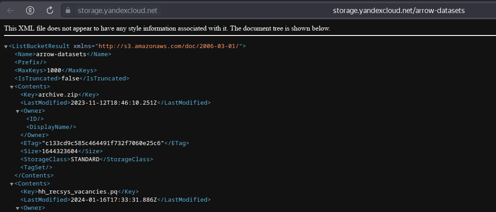
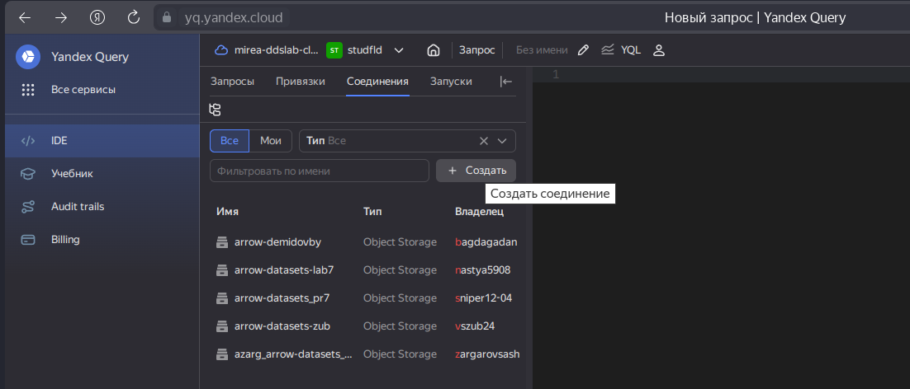
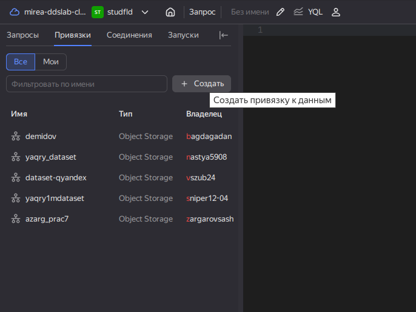
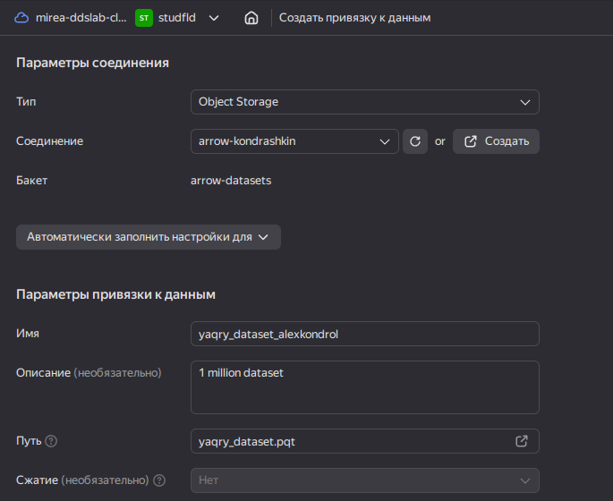
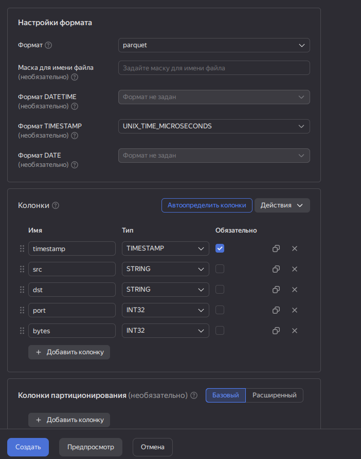
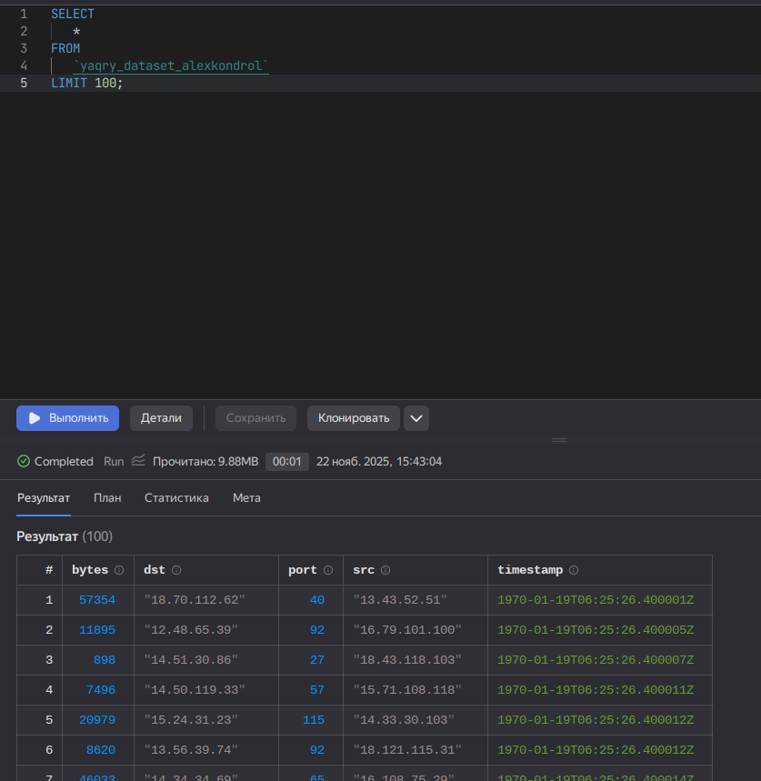
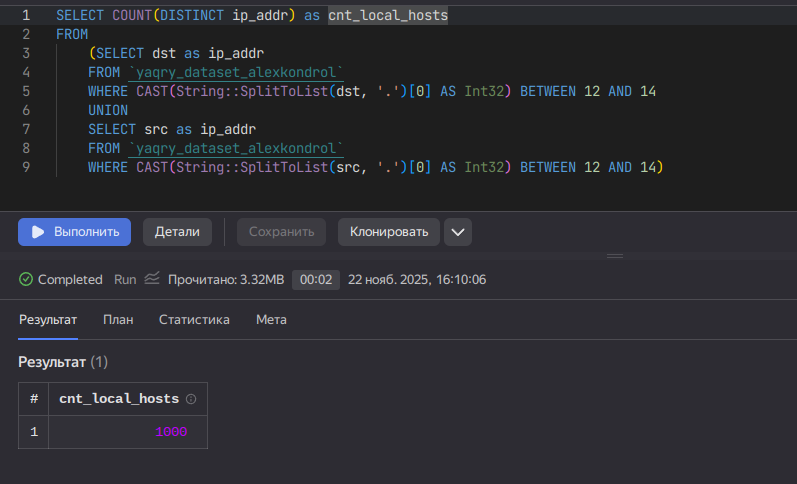
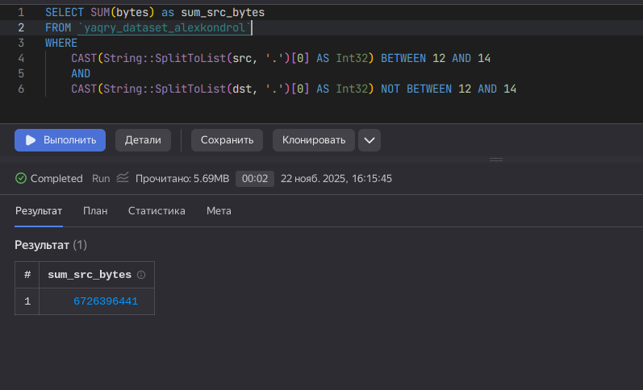
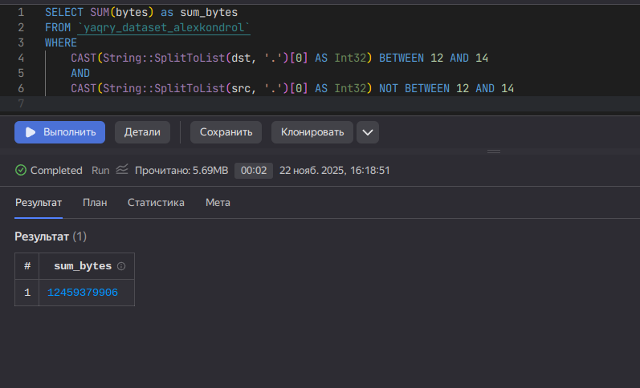

# Использование технологии Yandex Query для анализа данных сетевой
активности
alexkondrol@yandex.ru

## Цель работы

1.  Изучить возможности технологии `Yandex Query` для анализа
    структурированных наборов данных
2.  Получить навыки построения аналитического пайплайна для анализа
    данных с помощью сервисов `Yandex Cloud`
3.  Закрепить практические навыки использования `SQL` для анализа данных
    сетевой активности в сегментированной корпоративной сети

## Исходные данные

1.  Операционная система GNU/Linux
2.  Данные сетевой активности в корпративной сети компании XYZ, которых
    хранятся в `Yandex Object Storage`

## Задание

Используя сервис `Yandex Query` настроить доступ к данным, хранящимся в
сервисе хранения данных `Yandex Object Storage`. При помощи
соответствующих SQL запросов ответить на вопросы.

## Ход работы

1.  Проверить доступность данных в Yandex Object Storag
2.  Подключить бакет как источник данных для Yandex Query 2.1 Создать
    соединение для бакета в S3 хранилище 2.2 Заполняем поля с учетом
    допустимых символов 2.3 Создать привязку данных 2.4 Настройка
    привязки данных 2.5 Проверка правильности подключения
3.  Анализ 3.1. Известно, что IP адреса внутренней сети начинаются с
    октетов, принадлежащих интервалу \[12-14\]. Определите количество
    хостов внутренней сети, представленных в датасете 3.2. Определите
    суммарный объем исходящего трафи 3.3. Определите суммарный объем
    входящего трафика
4.  Оформить отчет

## Шаги

### 1. Проверить доступность данных в Yandex Object Storage

Воспользовшись
[инструкцией](https://cloud.yandex.ru/ru/docs/storage/concepts/bucket)
соорудил ссылку до бакета:
https://storage.yandexcloud.net/arrow-datasets, сам файл находится по
ссылке:
https://storage.yandexcloud.net/arrow-datasets/yaqry_dataset.pqt.

Мы можем просто перейти к бакету в браузере, чтобы убедиться в его
доступности:



### 2. Подключить бакет как источник данных для Yandex Query

#### 2.1 Создать соединение для бакета в S3 хранилище



#### 2.2 Заполняем поля с учетом допустимых символов


#### 2.3 Создать привязку данных



#### 2.4 Настройка привязки данных



Теперь настроим формат согласно схеме:

    SCHEMA=(
    timestamp TIMESTAMP NOT NULL,
    src STRING,
    dst STRING,
    port INT32,
    bytes INT32
    )



#### 2.5 Проверка правильности подключения

Для этого выполним простой запрос:

``` sql
SELECT
   *
FROM
   `yaqry_dataset_alexkondrol`
LIMIT 100;
```

и Ура, он вернул результаты:



### 3. Анализ

#### 3.1 Известно, что IP адреса внутренней сети начинаются с октетов, принадлежащих интервалу \[12-14\]. Определите количество хостов внутренней сети, представленных в датасете

Воспользуемся функцией `String::SplitToList`, чтобы разбить адрес в виде
строки на список строк (разделитель точка `.`), применем функцию как к
dst так и к src и выберм количество уникальных адресов.

**Примечание:** можно было воспользоваться `LIKE` и это было бы в разы
быстрее, но мы не ищем легких путей

``` sql
SELECT COUNT(DISTINCT ip_addr) as cnt_local_hosts
FROM
    (SELECT dst as ip_addr
    FROM `yaqry_dataset_alexkondrol`
    WHERE CAST(String::SplitToList(dst, '.')[0] AS Int32) BETWEEN 12 AND 14
    UNION
    SELECT src as ip_addr
    FROM `yaqry_dataset_alexkondrol`
    WHERE CAST(String::SplitToList(src, '.')[0] AS Int32) BETWEEN 12 AND 14)
```



Ровно 1000

#### 3.2. Определите суммарный объем исходящего трафика

``` sql
SELECT SUM(bytes) as sum_src_bytes
FROM `yaqry_dataset_alexkondrol`
WHERE 
    CAST(String::SplitToList(src, '.')[0] AS Int32) BETWEEN 12 AND 14 
    AND
    CAST(String::SplitToList(dst, '.')[0] AS Int32) NOT BETWEEN 12 AND 14
```



#### 3.3. Определите суммарный объем входящего трафика

Задача идентичная предыдущей, нужно лишь поменять местами `dst` и `src`

``` sql
SELECT SUM(bytes) as sum_bytes
FROM `yaqry_dataset_alexkondrol`
WHERE 
    CAST(String::SplitToList(dst, '.')[0] AS Int32) BETWEEN 12 AND 14 
    AND
    CAST(String::SplitToList(src, '.')[0] AS Int32) NOT BETWEEN 12 AND 14
```



## Вывод

В ходе практической работы я познакомился с сервисами Yandex Cloud,
изучил возможности технологии Yandex Query для анализа структурированных
наборов данных, узнал о хранилище S3
