# Использование технологии Yandex DataLens для анализа данных сетевой
активности
alexkondrol@yandex.ru

## Цель работы

1.  Изучить возможности технологии `Yandex DataLens` для визуального
    анализа структурированных наборов данных
2.  Получить навыки визуализации данных для последующего анализа с
    помощью сервисов `Yandex Cloud`
3.  Получить навыки создания решений `мониторинга/SIEM`на базе облачных
    продуктов и открытых программных решений
4.  Закрепить практические навыки использования `SQL` для анализа данных
    сетевой активности в сегментированной корпоративной сети

## Исходные данные

1.  Операционная система GNU/Linux
2.  Данные сетевой активности в корпративной сети компании XYZ, которых
    хранятся в `Yandex Object Storage`

## Задание

Используя сервис `Yandex DataLens` настроить доступ к `Yandex Query`,
который Вы использовали в ходе ранее выполненных практических работ, и
визуально представить результаты анализа данных.

## Ход работы

1.  Настроить подключение к Yandex Query из DataLens 1.1. Перейти в
    соответствующий сервиc 1.2. Выбрать “Подключения” – “Создать новое
    подключение” 1.3. Выбрать в разделе “Файлы и сервисы” Yandex Query
    1.4. Настроить и проверить подключение
2.  Создать из запроса YandexQuery датасет DataLens
3.  Сделать три чарта 3.1. Представить в виде круговой диаграммы
    соотношение внешнего и внутреннего сетевого трафика. 3.2.
    Представить в виде столбчатой диаграммы соотношение входящего и
    исходящего трафика из внутреннего сетвого сегмента. 3.3. Построить
    график активности (линейная диаграмма) объема трафика во времени.
4.  Объеденить графики в один дашборд

## Шаги

### 1. Настроить подключение к Yandex Query из DataLens

#### 1.1. Перейти в соответствующий сервиc

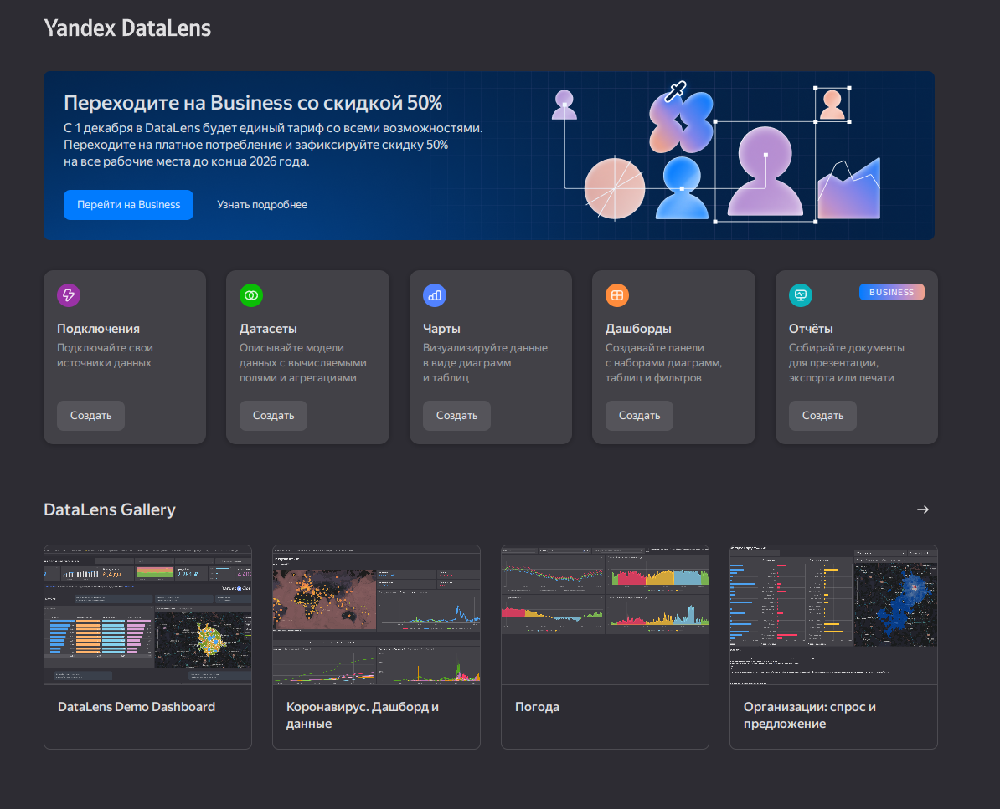

1.1. Перейти в соответствующий сервиcz

#### 1.2. Выбрать “Подключения” – “Создать новое подключение”

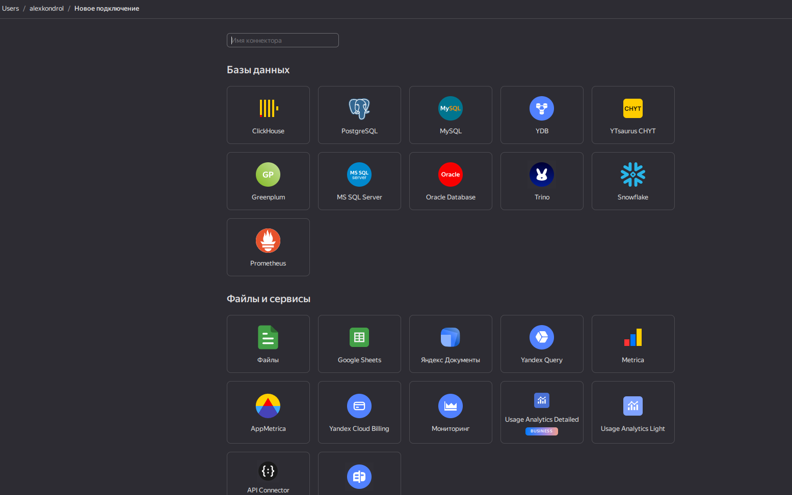

#### 1.3. Выбрать в разделе “Файлы и сервисы” Yandex Query

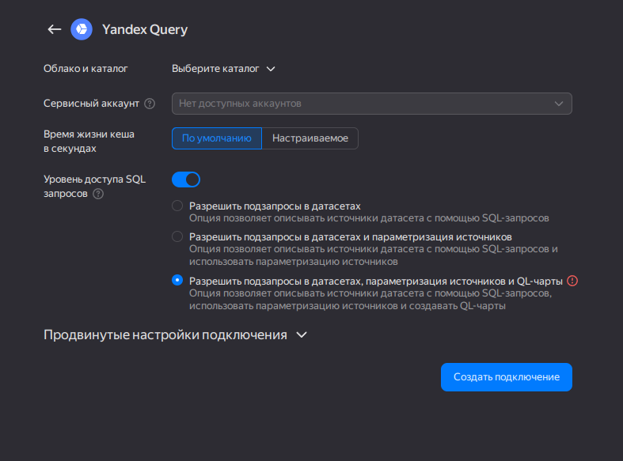

#### 1.4. Настроить и проверить подключение

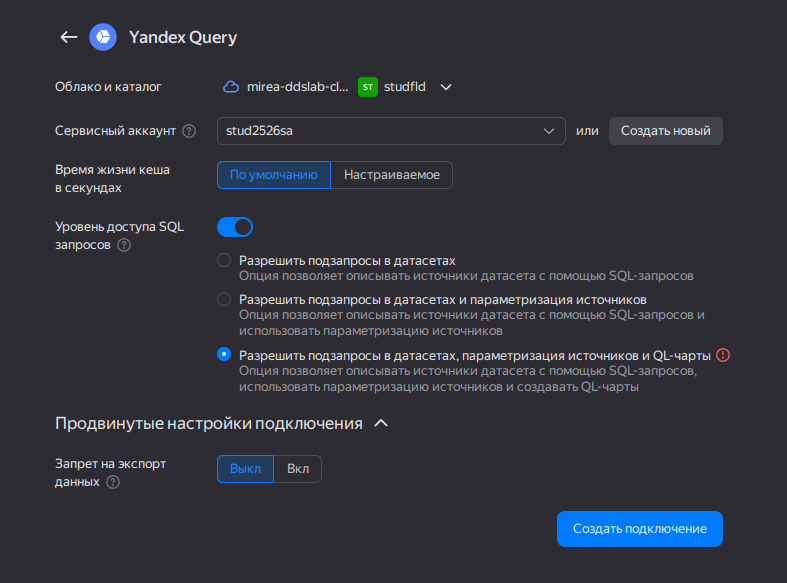

### 2. Создать из запроса YandexQuery датасет DataLens

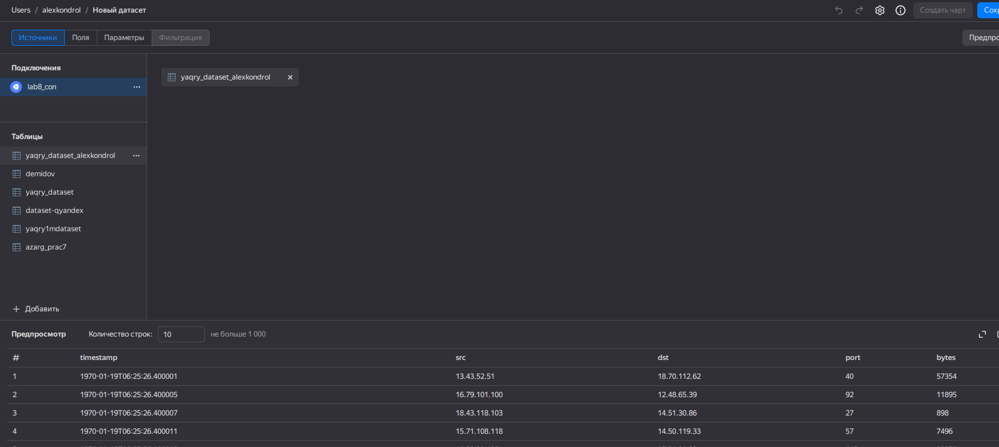

### 3. Сделать три чарта

Пример пустого чарта:

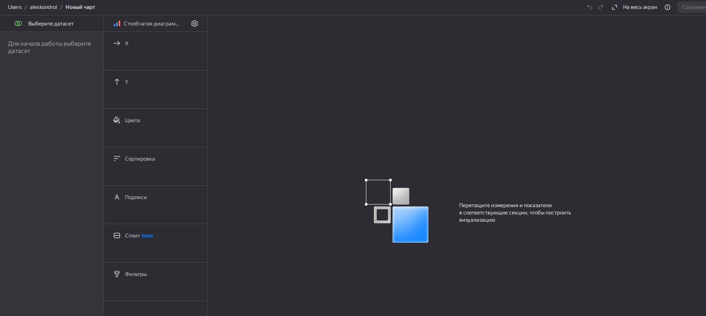

С выбранным датасетом:

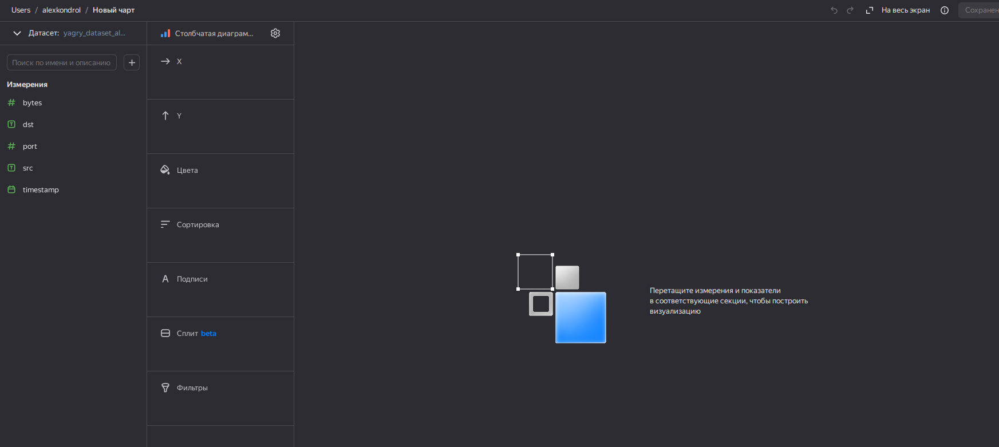

#### 3.1. Представить в виде круговой диаграммы соотношение внешнего и внутреннего сетевого трафика.

Для этого создадим вычисляемое поле, назовем его `local/global`, в нём
из информации, представленной в 7 практике мы разделим трафик на
внутренний (если все и отправитель и получатель находится в внутренней
сети) и внешний

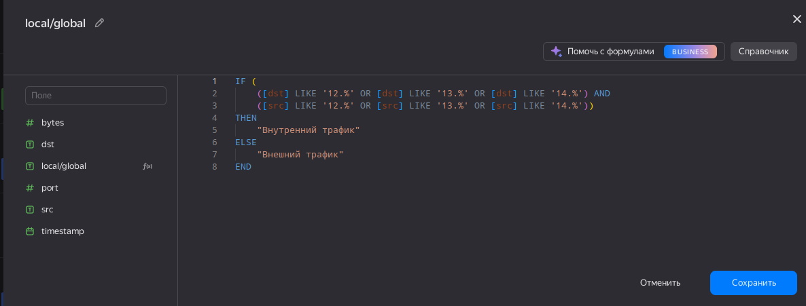

Это поле будет выступать за окраску нашей диаграммы, в качестве
показателя и подписи выберем поле `bytes`:

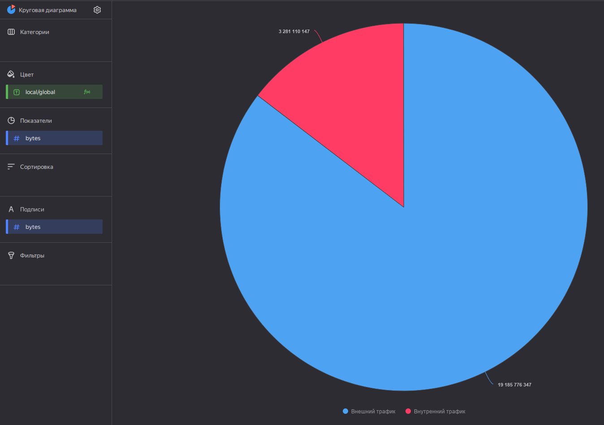

По диаграмме видно, что около 85% - внешний трафик, 15% - внутренний

#### 3.2. Представить в виде столбчатой диаграммы соотношение входящего и исходящего трафика из внутреннего сетевого сегмента.

Для этого создам поле `in/out`, у которого будет следующая логика:

Исходящий - это, когда внутренний IP → внешний IP Входящий - это, когда
внешний IP → внутренний IP

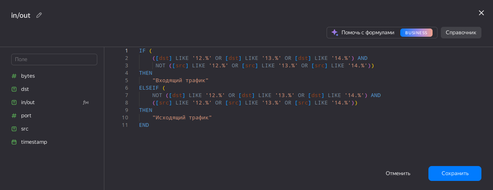

По Оси X размещу мое класифицирующее полу `in/out`, по оси Y `bytes`,
также для визуального эффекта в качестве Цвета укажу `in/out`, а в
качестве подписи `bytes`:

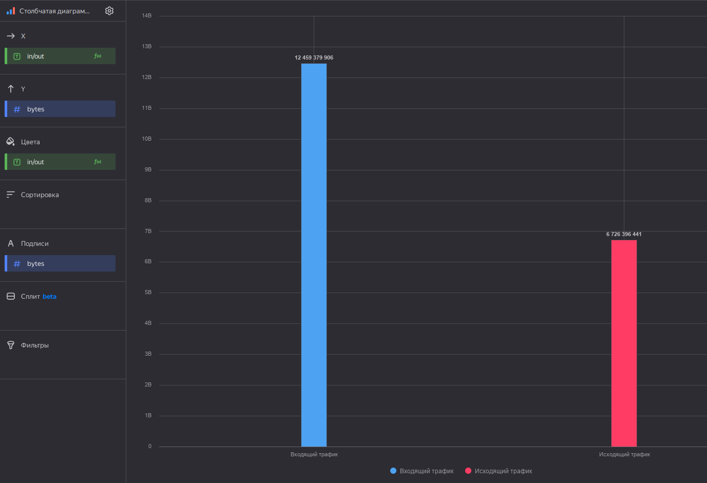

#### 3.3. Построить график активности (линейная диаграмма) объема трафика во времени.

Сначала хотел построить график в лоб, но нагрузка слишком большая:

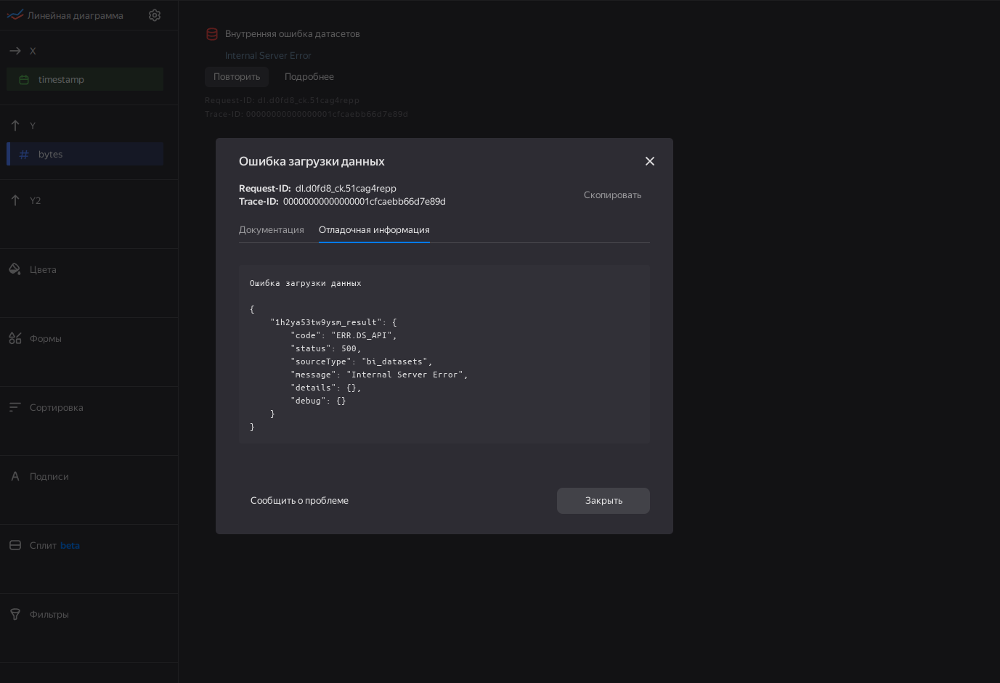

Если мы посмотрим на самое ранее и позднее время, мы увидем, что перед
сетевые подключения за чуть больше чем одну секунду:

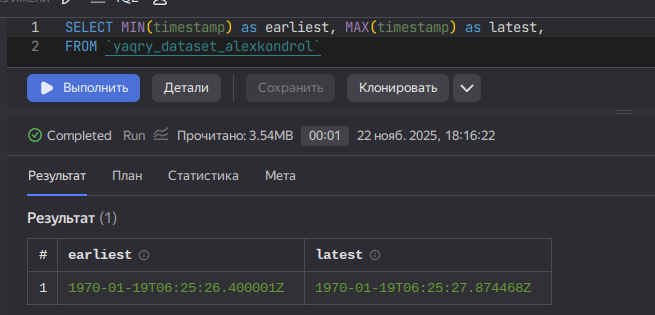

Т.е. нам нужно использовать доли секунды, чтобы построить график, для
этого воспользуемся функцией `DATETRUNC`, с помощью нее, мы округлим наш
`timestamp` до секунды, потом не хитрыми арифметическими операциями
получим нужные доли, домножим на 100000, то есть переводим дробную часть
секунды в диапазон 0–100000.

Методом перебора, определяем оптимальное округление - 2

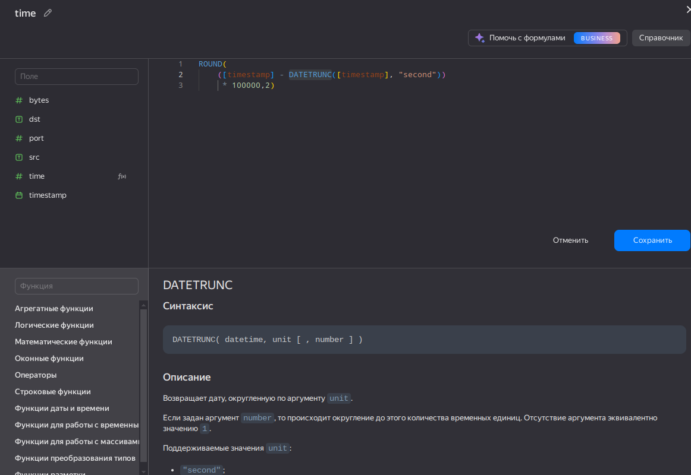

Расположим по оси X наше поле `time`, на оси Y поле `bytes`:

### 4. Составляем дашборд

Пример добавления одного чарта

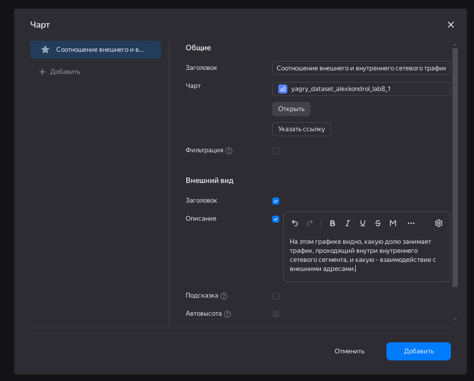

Готовый дашборд:

## Выводы

В ходе практической работы я научился работать с сервисом
`Yandex DataLens`, делать чарты и составлять из них дашборд. Понял
насколь важно средства observability и для мониторинга.
